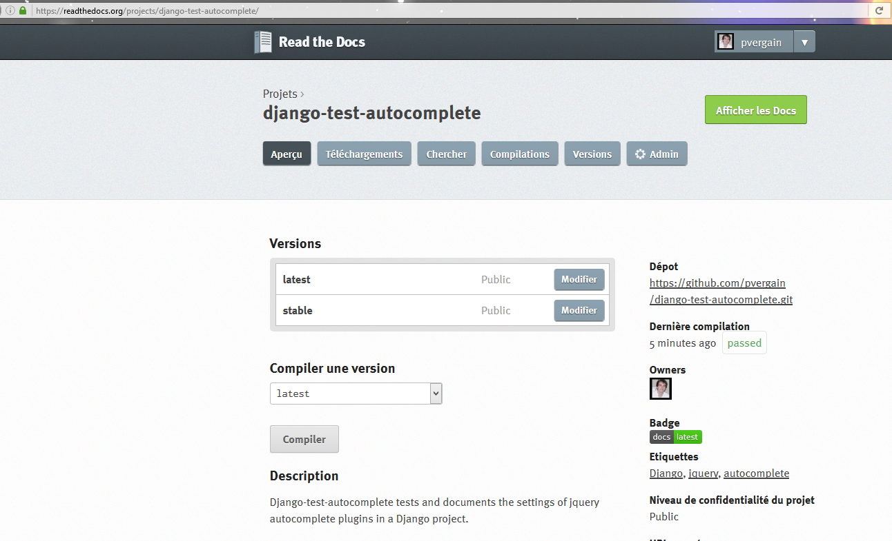
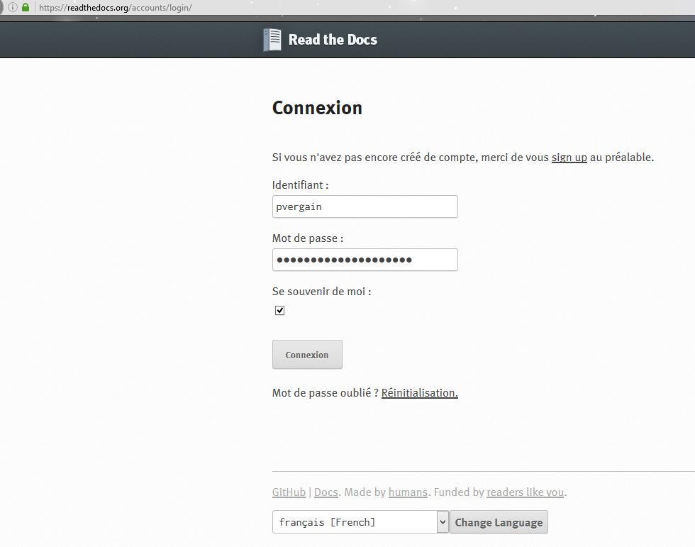
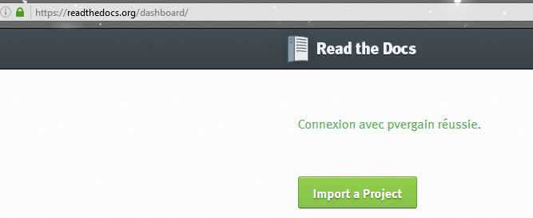
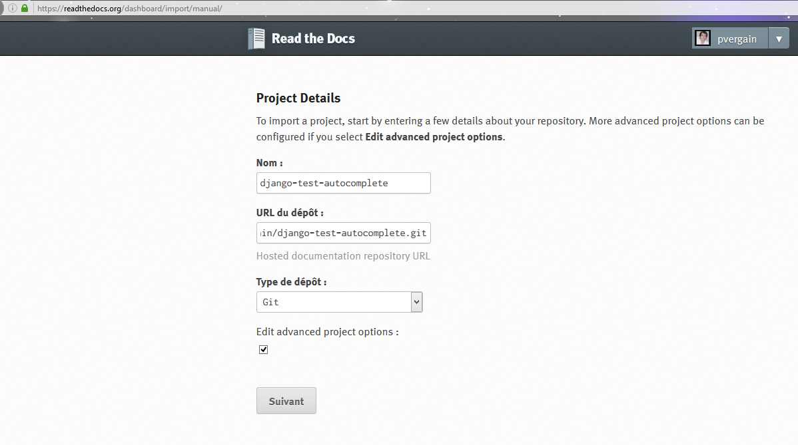
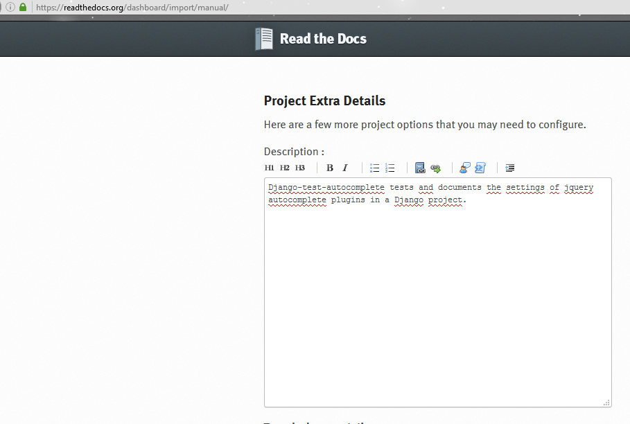
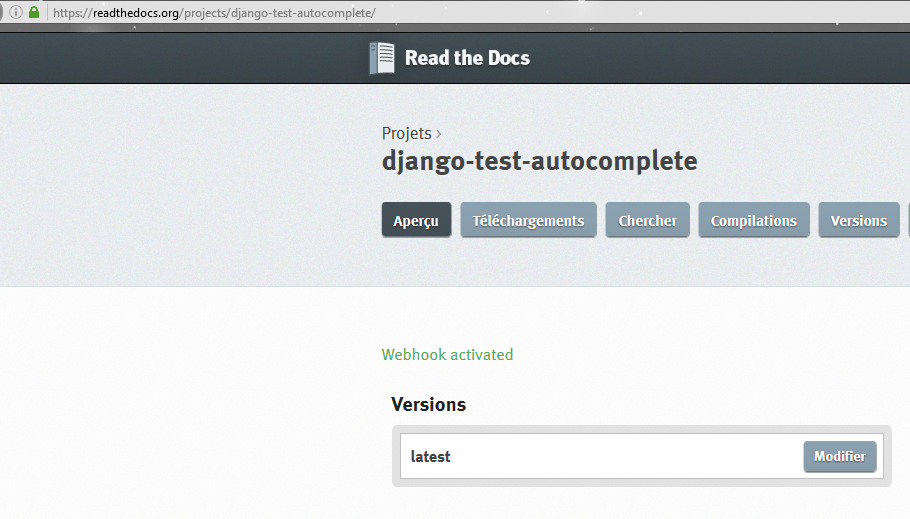
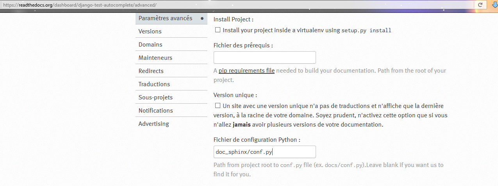
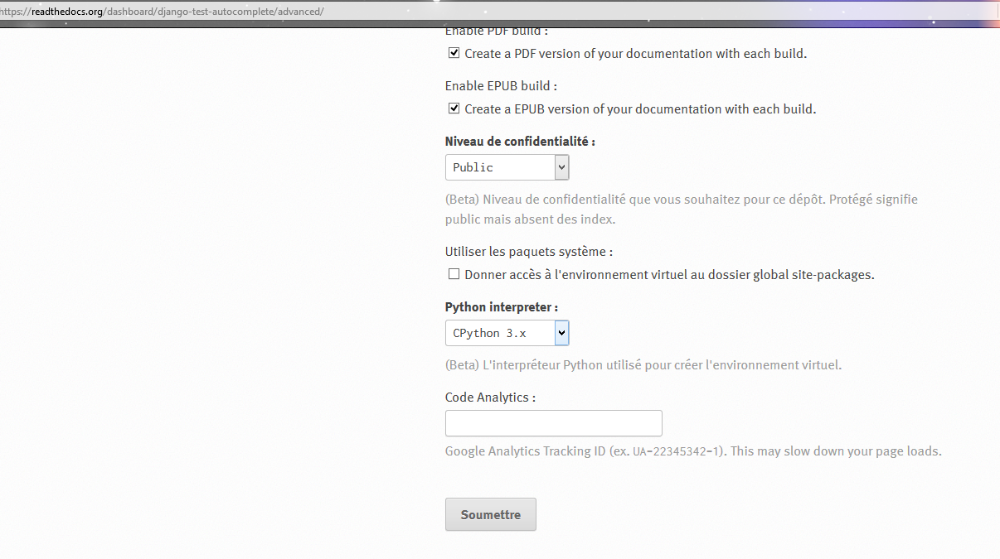

.. index::
   pair: doc; read the docs

.. _doc_on_read_the_docs:

======================================================================================
2016-10-21 pushing documentation on readthedocs
======================================================================================

.. seealso::

   - https://readthedocs.org/
   - https://readthedocs.org/accounts/login/
   - https://django-test-autocomplete.readthedocs.io/en/latest/
   - https://readthedocs.org/projects/django-test-autocomplete/

   

Connect to readthedocs
=======================

.. seealso:: 

   - https://readthedocs.org/accounts/login/

   
   

Import a projet 
================

.. seealso::

   - https://docs.readthedocs.io/en/latest/getting_started.html#import-docs

   
   

   

      
   

      
  
Advanced parameters
====================

   

   
