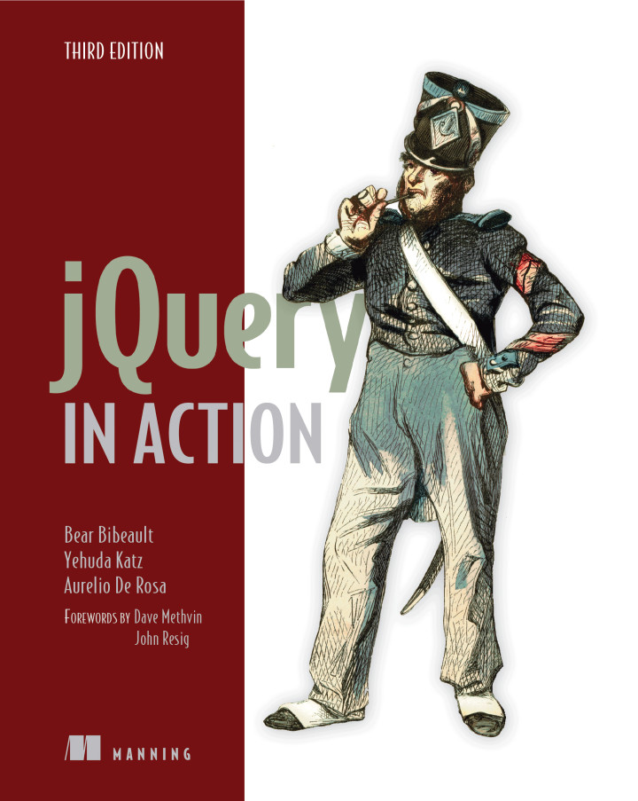

.. index::
   pair: jQuery ; TJ VanToll
   pair: jQuery ; Aurelio De Rosa
   
   

.. _jquery_in_action:

========================================================================================================
2016-10-21 Receive 2 new excellent books about jQuery: ``jQuery In Action`` and ``jquery UI in Action``
========================================================================================================

.. seealso::

   - https://twitter.com/tjvantoll
   - https://twitter.com/AurelioDeRosa
   - http://developer.telerik.com/featured/is-jquery-still-relevant/
   - https://trends.builtwith.com/javascript/jQuery
   

.. contents::
   :depth: 3

jQuery in Action (third edition)
=================================

.. seealso::

   - https://github.com/AurelioDeRosa/jquery-in-action
   - https://twitter.com/AurelioDeRosa
   - hhttps://www.manning.com/books/jquery-in-action-third-edition
   

   
   
.. figure:: aurelio_de_rosa.png
   :align: center   
   
   Aurelio De Rosa (https://twitter.com/AurelioDeRosa)

jQuery UI in Action
====================

.. seealso::

   - https://github.com/tjvantoll/jquery-ui-in-action-demos
   - https://twitter.com/tjvantoll
   - https://twitter.com/jenlooper   
   - https://www.manning.com/books/jquery-ui-in-action
   
   

.. figure:: jquery_ui_in_action.png
   :align: center
   

   
   TJ Vantoll (https://twitter.com/tjvantoll)

   
