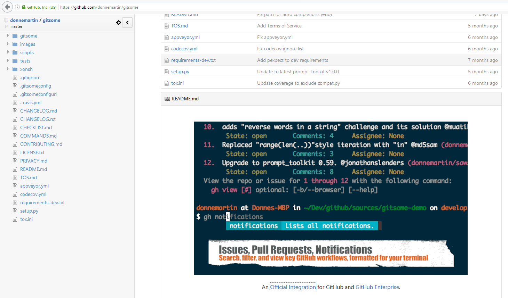

.. index::
   pair: git ; gitsome
   pair: github ; https://github.com/anseki 
   
   

.. _gitsome:

==============================================================================
2016-10-25 installing gitsome 
==============================================================================

.. seealso::

   - :ref:`django_autocomplete_light`
   - https://github.com/donnemartin/gitsome
   - https://github.com/integrations/gitsome
   - https://twitter.com/donne_martin

   
   An `Official Integration for GitHub`_ and GitHub Enterprise. 
   
   

.. _`Official Integration for GitHub`:  https://github.com/integrations/gitsome   

install
===========

::

    (django_test_autocomplete_35_64) C:\projects_id3\django-test-autocomplete>pip install gitsome

    Collecting gitsome
      Downloading gitsome-0.6.0.tar.gz (308kB)
        100% |################################| 317kB 819kB/s
    Collecting numpydoc<1.0,>=0.5 (from gitsome)
      Downloading numpydoc-0.6.0.tar.gz
    Collecting ply<4.0,>=3.4 (from gitsome)
      Downloading ply-3.9.tar.gz (150kB)
        100% |################################| 153kB 1.3MB/s
    Requirement already satisfied (use --upgrade to upgrade): prompt-toolkit<1.1.0,>=1.0.0 in c:\project\python_envs\django_test_autocomplete_35_64\lib\site-packages (from gitsome)
    Requirement already satisfied (use --upgrade to upgrade): requests<3.0.0,>=2.8.1 in c:\project\python_envs\django_test_autocomplete_35_64\lib\site-packages (from gitsome)
    Requirement already satisfied (use --upgrade to upgrade): colorama<1.0.0,>=0.3.3 in c:\project\python_envs\django_test_autocomplete_35_64\lib\site-packages (from gitsome)
    Collecting click<7.0,>=5.1 (from gitsome)
    Requirement already satisfied (use --upgrade to upgrade): pygments<3.0.0,>=2.0.2 in c:\project\python_envs\django_test_autocomplete_35_64\lib\site-packages (from gitsome)
    Collecting feedparser<6.0.0,>=5.2.1 (from gitsome)
      Downloading feedparser-5.2.1.zip (1.2MB)
        100% |################################| 1.2MB 655kB/s
    Requirement already satisfied (use --upgrade to upgrade): pytz<2017.0,>=2016.3 in c:\project\python_envs\django_test_autocomplete_35_64\lib\site-packages (from gitsome)
    Collecting docopt<1.0.0,>=0.6.2 (from gitsome)
    Collecting uritemplate.py<1.0.0,>=0.2.0 (from gitsome)
      Downloading uritemplate.py-0.3.0.tar.gz
    Requirement already satisfied (use --upgrade to upgrade): wcwidth in c:\project\python_envs\django_test_autocomplete_35_64\lib\site-packages (from prompt-toolkit<1.1.0,>=1.0.0->gitsome)
    Requirement already satisfied (use --upgrade to upgrade): six>=1.9.0 in c:\project\python_envs\django_test_autocomplete_35_64\lib\site-packages (from prompt-toolkit<1.1.0,>=1.0.0->gitsome)
    Building wheels for collected packages: gitsome, numpydoc, ply, feedparser, uritemplate.py
      Running setup.py bdist_wheel for gitsome ... done
      Stored in directory: C:\Users\pvergain\AppData\Local\pip\Cache\wheels\c8\4f\5a\128527ed75a5c07780bcef517c1be9a031b0f4672c369fc4a1
      Running setup.py bdist_wheel for numpydoc ... done
      Stored in directory: C:\Users\pvergain\AppData\Local\pip\Cache\wheels\9d\ca\8c\9be286b195791bbbfebfd407899de13eb12725a2c2c9fdb36f
      Running setup.py bdist_wheel for ply ... done
      Stored in directory: C:\Users\pvergain\AppData\Local\pip\Cache\wheels\c1\0c\bd\306a63396decbe8353a4a056fcba97a092be0e035522bc567d
      Running setup.py bdist_wheel for feedparser ... done
      Stored in directory: C:\Users\pvergain\AppData\Local\pip\Cache\wheels\15\ce\10\b500f745822ea6db6ea8ed225c06b15c000d71016b89ef9037
      Running setup.py bdist_wheel for uritemplate.py ... done
      Stored in directory: C:\Users\pvergain\AppData\Local\pip\Cache\wheels\f0\28\64\52c28cc4428d1c79eb7e923cade677f5e63ae1d2fd5d274e19
    Successfully built gitsome numpydoc ply feedparser uritemplate.py
    Installing collected packages: numpydoc, ply, click, feedparser, docopt, uritemplate.py, gitsome
    Successfully installed click-6.6 docopt-0.6.2 feedparser-5.2.1 gitsome-0.6.0 numpydoc-0.6.0 ply-3.9 uritemplate.py-0.3.0
    
    
    
