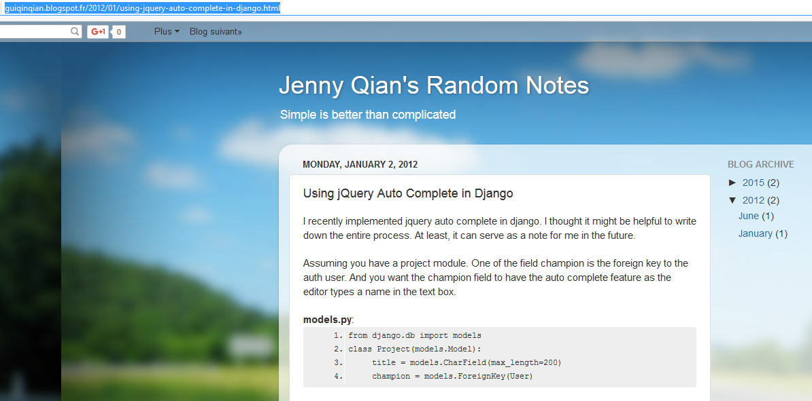

.. index::
   pair: Django ; base.html

.. _autocomplete:

============================================================================
2016-10-18 try a more simple approach with jquery-ui 
============================================================================

.. seealso::

   - http://guiqinqian.blogspot.fr/2012/01/using-jquery-auto-complete-in-django.html
   - https://github.com/jquery/jquery-ui
   
   
.. contents::
   :depth: 3

Installation
=============

   

Create a ``projects`` application
==================================   

::

    python manage.py startapp projects

::

    |   ajax_selects_singers_db
    |   manage.py
    |   tree.txt
    |   
    +---projects
    |   |   admin.py
    |   |   apps.py
    |   |   models.py
    |   |   tests.py
    |   |   views.py
    |   |   __init__.py
    |   |   
    |   \---migrations
    |           __init__.py

    
Add the Django model ``Project``
================================

.. literalinclude:: ../../../../projet_ajax/projects/models.py
   :linenos:

Add the ``project`` in the INSTALLED_APPS
=========================================

::

        # # https://docs.djangoproject.com/en/dev/ref/applications/#django.apps.AppConfig
        'singers.apps.SingersConfig',
        # http://guiqinqian.blogspot.fr/2012/01/using-jquery-auto-complete-in-django.html
        'projects.apps.ProjectsConfig'
    ]

.. literalinclude:: ../../../../projet_ajax/projet_ajax/settings.py
   :linenos:

makemigrations
===============

::

    python manage.py makemigrations projects
    
::

    Migrations for 'projects':
      projects\migrations\0001_initial.py:
        - Create model Project    
        
.. literalinclude:: ../../../../projet_ajax/projects/migrations/0001_initial.py
   :linenos:

    

sqlmigrate
===========

::

    python manage.py sqlmigrate projects
    
    
::

    (ajax_django_35) C:\projects_id3\django_ajax_select\projet_ajax>python manage.py sqlmigrate projects 0001

::

    BEGIN;
    --
    -- Create model Project
    --
    CREATE TABLE "projects_project" ("id" integer NOT NULL PRIMARY KEY AUTOINCREMENT, "title" varchar(200) NOT NULL, "champion_id" integer NOT NULL REFERENCES "auth_user" ("id"));
    CREATE INDEX "projects_project_68b9a77a" ON "projects_project" ("champion_id");
    COMMIT;    

migrate
========

::

    python manage.py migrate projects
    
    
::

    Operations to perform:
      Apply all migrations: projects
    Running migrations:
      Applying projects.0001_initial... OK
        

Create the projects/forms.py file and add a form
=================================================

.. literalinclude:: ../../../../projet_ajax/projects/forms.py
   :linenos:

Create the projects/urls.py file and add the champion auto complete URL  
========================================================================

.. literalinclude:: ../../../../projet_ajax/projects/urls.py
   :linenos:

    
        

   
       
   
   
