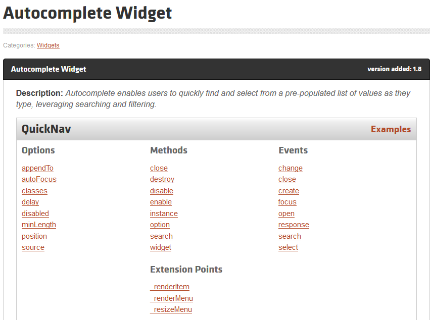
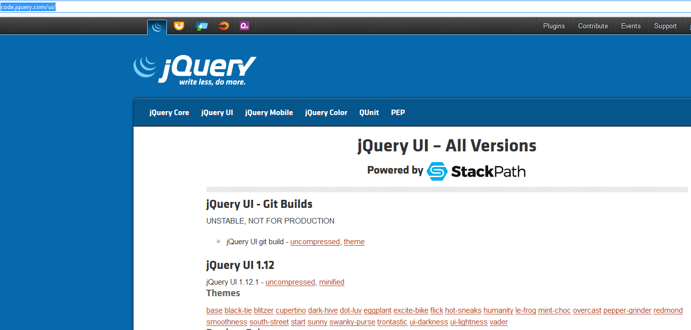
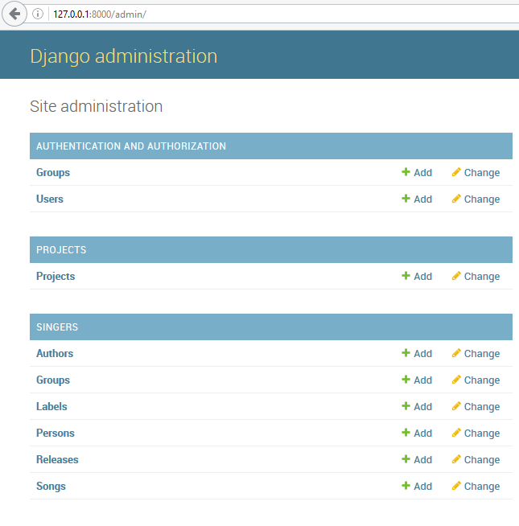
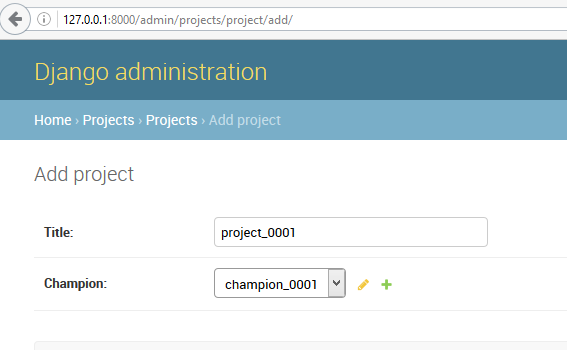
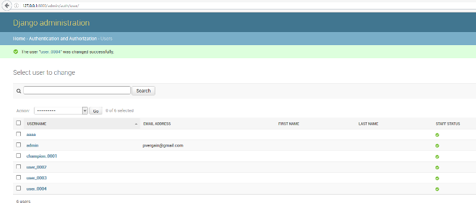

.. index::
   pair: Django ; base.html
   pair: jQuery ; UI
   pair: jQuery-ui ; autocomplete

.. _autocomplete:

============================================================================
2016-10-18 try a more simple approach with jquery-ui autocomplete widget
============================================================================

.. seealso::

   - https://jqueryui.com/autocomplete/
   - http://guiqinqian.blogspot.fr/2012/01/using-jquery-auto-complete-in-django.html
   - https://github.com/jquery/jquery-ui
   

     
   
.. contents::
   :depth: 3

Installation
=============

.. figure:: jenny_qian_solution.png
   :align: center
   
Other sources:

- http://blog.appliedinformaticsinc.com/autocomplete-input-field-in-django-template-with-jquery-ui/
- https://openclassrooms.com/courses/decouvrez-la-puissance-de-jquery-ui/l-autocompletion-1

Create a ``projects`` application
==================================   

::

    python manage.py startapp projects

::

    |   ajax_selects_singers_db
    |   manage.py
    |   tree.txt
    |   
    +---projects
    |   |   admin.py
    |   |   apps.py
    |   |   models.py
    |   |   tests.py
    |   |   views.py
    |   |   __init__.py
    |   |   
    |   \---migrations
    |           __init__.py

    
Add the Django model ``Project``
================================

.. literalinclude:: ../../../../projet_ajax/projects/models.py
   :linenos:

Add the ``project`` in the INSTALLED_APPS
=========================================

::

        # # https://docs.djangoproject.com/en/dev/ref/applications/#django.apps.AppConfig
        'singers.apps.SingersConfig',
        # http://guiqinqian.blogspot.fr/2012/01/using-jquery-auto-complete-in-django.html
        'projects.apps.ProjectsConfig'
    ]

.. literalinclude:: ../../../../projet_ajax/projet_ajax/settings.py
   :linenos:

makemigrations
===============

::

    python manage.py makemigrations projects
    
::

    Migrations for 'projects':
      projects\migrations\0001_initial.py:
        - Create model Project    
        
.. literalinclude:: ../../../../projet_ajax/projects/migrations/0001_initial.py
   :linenos:

    

sqlmigrate
===========

::

    python manage.py sqlmigrate projects
    
    
::

    (ajax_django_35) C:\projects_id3\django_ajax_select\projet_ajax>python manage.py sqlmigrate projects 0001

::

    BEGIN;
    --
    -- Create model Project
    --
    CREATE TABLE "projects_project" ("id" integer NOT NULL PRIMARY KEY AUTOINCREMENT, "title" varchar(200) NOT NULL, "champion_id" integer NOT NULL REFERENCES "auth_user" ("id"));
    CREATE INDEX "projects_project_68b9a77a" ON "projects_project" ("champion_id");
    COMMIT;    

migrate
========

::

    python manage.py migrate projects
    
    
::

    Operations to perform:
      Apply all migrations: projects
    Running migrations:
      Applying projects.0001_initial... OK
        

Create the projects/forms.py file and add 2 forms
=================================================

.. literalinclude:: ../../../../projet_ajax/projects/forms.py
   :linenos:

Create the projects/urls.py file and add the champion auto complete URL  
========================================================================

.. literalinclude:: ../../../../projet_ajax/projects/urls.py
   :linenos:

Add the projects.urls file to the root urls.py
================================================

::

    url(r'^projects/', include('projects.urls', namespace='projects')),

.. literalinclude:: ../../../../projet_ajax/projet_ajax/urls.py
   :linenos:

Add the ProjectUpdateView 
==========================

.. literalinclude:: ../../../../projet_ajax/projects/views.py
   :linenos:
   
   
Create the templates/projects/project/update.html django template
==================================================================

.. seealso::

   - http://code.jquery.com/ui/

This template file is used by the ProjectUpdateView.

   

.. literalinclude:: ../../../../projet_ajax/projects/templates/projects/project/update.html
   :linenos:
   
   
Add the jquery-ui javascript code
==================================

.. seealso::

   - http://api.jqueryui.com/autocomplete/
   - http://api.jqueryui.com/autocomplete/#option-source
   - http://api.jqueryui.com/autocomplete/#option-minLength
   - http://api.jqueryui.com/autocomplete/#event-select

   

::

    $( "#id_champion_display" ).autocomplete({
          source: "",
          minLength:2,
          select:function(event,ui) {
            $("#id_champion").val(ui.item.id)
          }
    });   
   
   
Add the admin interface
=======================

.. literalinclude:: ../../../../projet_ajax/projects/admin.py
   :linenos:

Create some projects with the admin interface
=============================================

   

   

Reading Project record from the commande line
=============================================

::

    python manage.py shell_plus
    
    
    (ajax_django_35) C:\projects_id3\django_ajax_select\projet_ajax>python manage.py shell_plus
    # Shell Plus Model Imports
    from django.contrib.admin.models import LogEntry
    from django.contrib.auth.models import Group, Permission, User
    from django.contrib.contenttypes.models import ContentType
    from django.contrib.sessions.models import Session
    from projects.models import Project
    from singers.models import Author, Book, Group, Label, Person, Release, Song
    # Shell Plus Django Imports
    from django.db.models import Avg, Case, Count, F, Max, Min, Prefetch, Q, Sum, When
    from django.db import transaction
    from django.conf import settings
    from django.utils import timezone
    from django.urls import reverse
    from django.core.cache import cache
    Python 3.5.2 (v3.5.2:4def2a2901a5, Jun 25 2016, 22:18:55) [MSC v.1900 64 bit (AMD64)]
    Type "copyright", "credits" or "license" for more information.

    IPython 5.1.0 -- An enhanced Interactive Python.
    ?         -> Introduction and overview of IPython's features.
    %quickref -> Quick reference.
    help      -> Python's own help system.
    object?   -> Details about 'object', use 'object??' for extra details.

    In [1]: p1=Project.objects.first()

    In [2]: p1
    Out[2]: <Project: project_0001 champion_0001>

    In [3]: p1.id
    Out[3]: 1
    

Add some users with the admin interface
========================================

 
 
Add some users with the command line interface
===============================================   
   
.. seealso::

   - https://docs.djangoproject.com/en/dev/topics/auth/default/#user-objects   
   
   
The most direct way to create users is to use the included create_user() 
helper function:   

::

    In [4]: user = User.objects.create_user('john', 'lennon@thebeatles.com', 'johnpassword')

    In [5]: user = User.objects.create_user('albert', 'albert@thebeatles.com', 'albertpassword')

    In [6]: user = User.objects.create_user('zoya', 'zoya@thebeatles.com', 'zoyapassword')

    In [7]: user = User.objects.create_user('nigel', 'nigel@thebeatles.com', 'nigelpassword')

    In [8]: users=User.objects.all()

    In [9]: users
    Out[9]: <QuerySet [<User: admin>, <User: champion_0001>, <User: user_0002>, <User: user_0003>, <User: user_0004>, <User: aaaa>, <User: john>, <User: albert>, <User: zoya>, <User: nigel>]>

.. _last_look:

Try the URL : http://127.0.0.1:8000/projects/project/1/update
===============================================================

**OK, this time this works fine !**

.. warning:: La saisie est agréable, il faut améliorer le look.

.. figure:: ok_saisie_champion.png
   :align: center
   
   

::

    [18/Oct/2016 15:17:26] "GET /projects/project/1/update/ HTTP/1.1" 200 3423
    [18/Oct/2016 15:17:44] "GET /projects/champion_auto_complete/?term=zo HTTP/1.1" 200 45
    [18/Oct/2016 15:17:51] "POST /projects/project/1/update/ HTTP/1.1" 302 0
    [18/Oct/2016 15:17:51] "GET /projects/project/1/update/ HTTP/1.1" 200 3418
    [18/Oct/2016 15:18:47] "GET /projects/champion_auto_complete/?term=ni HTTP/1.1" 200 48
    [18/Oct/2016 15:19:00] "POST /projects/project/1/update/ HTTP/1.1" 302 0
    [18/Oct/2016 15:19:00] "GET /projects/project/1/update/ HTTP/1.1" 200 3420

    

    

      
   
   

   

 

    
        

   
       
   
   
