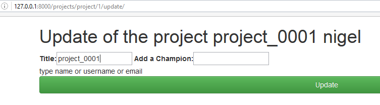

.. index::
   pair: Django ; base.html

.. _autocomplete_5:

============================================================================
2016-10-18 improve the jquery-ui autocomplete look and feel
============================================================================

.. seealso::

   - https://jqueryui.com/autocomplete/
   - https://jqueryui.com/autocomplete/#combobox

.. contents::
   :depth: 3

Last look
==========

.. seealso::

   - http://127.0.0.1:8004/projects/project/1/update/
   

   
   

jquery-ui autocomplete options already used
===========================================

Remote option
---------------

- https://jqueryui.com/autocomplete/#remote 

The Autocomplete widgets provides suggestions while you type into the field. 
Here the suggestions are bird names, displayed when at least two characters 
are entered into the field.

The datasource is a server-side script which returns JSON data, specified via 
a simple URL for the source-option. In addition, the minLength-option is set 
to 2 to avoid queries that would return too many results and the select-event 
is used to display some feedback.

.. code-block:: html

    <!doctype html>
    <html lang="en">
    <head>
      <meta charset="utf-8">
      <meta name="viewport" content="width=device-width, initial-scale=1">
      <title>jQuery UI Autocomplete - Remote datasource</title>
      <link rel="stylesheet" href="//code.jquery.com/ui/1.12.1/themes/base/jquery-ui.css">
      <link rel="stylesheet" href="/resources/demos/style.css">
      
      
      
      
    </head>
    <body>
     
    

      <label for="birds">Birds: </label>
      <input id="birds">
    

     
    

      Result:
      

    

     
     
    </body>
    </html>
      
   
   
Try https://jqueryui.com/autocomplete/#combobox
================================================= 

.. seealso::

   - http://www.learningjquery.com/2010/06/a-jquery-ui-combobox-under-the-hood

Try https://jqueryui.com/autocomplete/#maxheight
=================================================
   
.. seealso::

   - https://jqueryui.com/autocomplete/#maxheight
   

Try https://jqueryui.com/autocomplete/#categories
===================================================   
   
   
.. seealso::

   - https://jqueryui.com/autocomplete/#categories
      
      
::

    <!doctype html>
    <html lang="en">
    <head>
      <meta charset="utf-8">
      <meta name="viewport" content="width=device-width, initial-scale=1">
      <title>jQuery UI Autocomplete - Categories</title>
      <link rel="stylesheet" href="//code.jquery.com/ui/1.12.1/themes/base/jquery-ui.css">
      <link rel="stylesheet" href="/resources/demos/style.css">
      
      
      
      
    </head>
    <body>
     
    <label for="search">Search: </label>
    <input id="search">
     
     
    </body>
    </html>      
   

Try https://jqueryui.com/autocomplete/#remote-jsonp
====================================================     
     
.. seealso::

   - https://jqueryui.com/autocomplete/#remote-jsonp  
   

::

    <!doctype html>
    <html lang="en">
    <head>
      <meta charset="utf-8">
      <meta name="viewport" content="width=device-width, initial-scale=1">
      <title>jQuery UI Autocomplete - Remote JSONP datasource</title>
      <link rel="stylesheet" href="//code.jquery.com/ui/1.12.1/themes/base/jquery-ui.css">
      <link rel="stylesheet" href="/resources/demos/style.css">
      
      
      
      
    </head>
    <body>
     
    

      <label for="birds">Birds: </label>
      <input id="birds">
    

     
    

      Result:
      

    

     
     
    </body>
    </html>   
          
   
   
