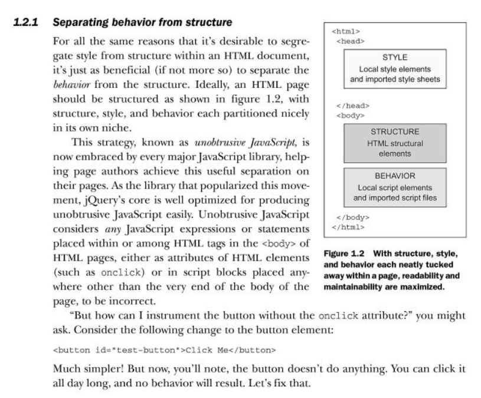

.. index::
   pair: Django ; Template
   pair: Javascript ; Unobstrusive

.. _javascript_unobstrusive:

============================================================================
2016-10-18 improve the Django templates + unobstrusive Javascript
============================================================================

.. contents::
   :depth: 3

The Javascript code must be in the the body element
=====================================================

.. seealso::

   - https://www.amazon.fr/gp/product/1617292079/ref=oh_aui_detailpage_o00_s00?ie=UTF8&psc=1
   

   
   
Modify names
============

- champion_auto_complete -> champion_get_json

