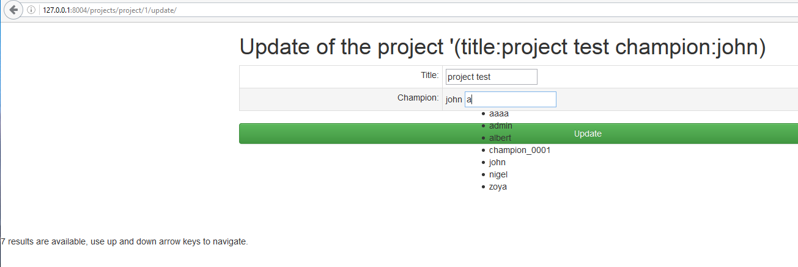
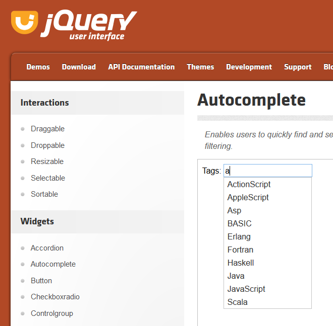
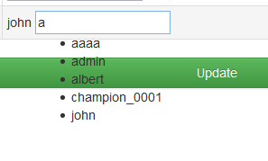

.. _look2:

============================================================================
2016-10-19 improve the look (step2)
============================================================================

.. contents::
   :depth: 3

Step2
=====

   
   
.. code-block:: django

    {# https://docs.djangoproject.com/en/dev/topics/forms/ #}
    <form id="id_form_project_update" action="" method="post">
        
        

            {{ form.id }}
            {{ form.non_field_errors }}
            {# Include the hidden fields #}
            
                {{ hidden }}
            
            <table id="id_table" class="table table-hover table-bordered table-condensed">
                <tbody>
                        <tr>
                            <td class="text-right">Title:</td>
                            <td>{{ form.title }}</td>
                        </tr>
                        <tr>
                            <td class="text-right">Champion:</td>
                            <td> {{ project.champion }} {{ form.champion_term }}  </td>
                        </tr>
                </tbody>
            </table>
        

        <input type="submit" name="btn_update"  value="Update" class="btn btn-success btn-block" />
    </form>
    
    {# DOM ready #}
    

        $( "#id_champion_term" ).autocomplete({
              {# http://api.jqueryui.com/autocomplete/#option-source #}
              source: "",
              {# http://api.jqueryui.com/autocomplete/#option-autoFocus #}
              autoFocus:true,
              {# http://api.jqueryui.com/autocomplete/#option-minLength #}
              minLength:1,
              {# http://api.jqueryui.com/autocomplete/#event-select #}
              select:function(event,ui) {
                  $("#id_champion").val(ui.item.id);
              }
        });

        
    
    
CSS Problem  ?
================

I think it's a CSS problem but I don't known how to resolve it.

   
   
We clearly see the box around the list of elements, but when I take 
the source code we have no box.

   
   
I don't know whet to do
========================   

 

