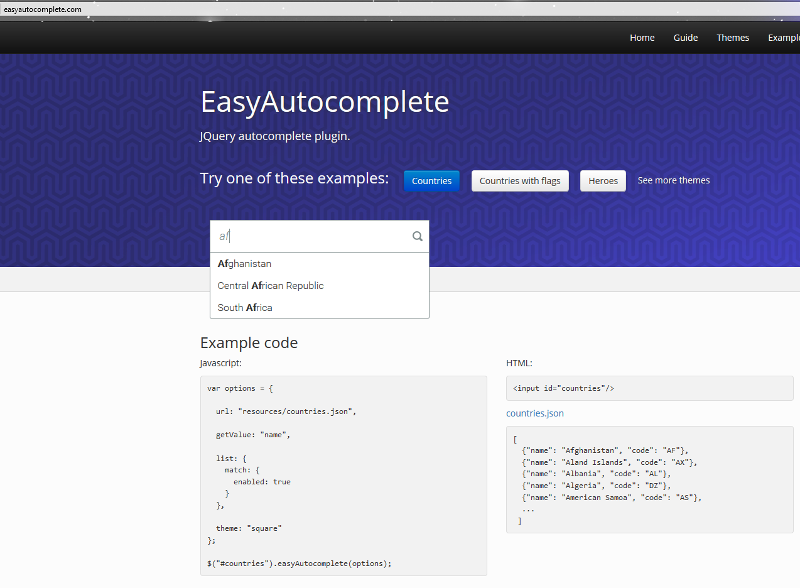
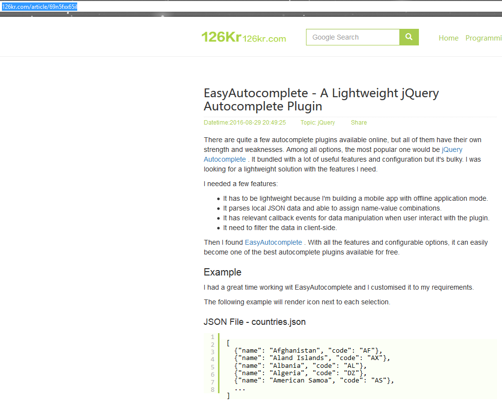
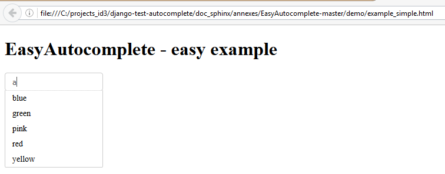
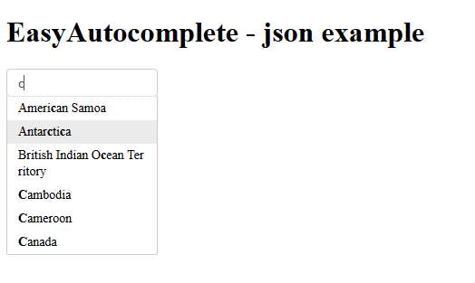
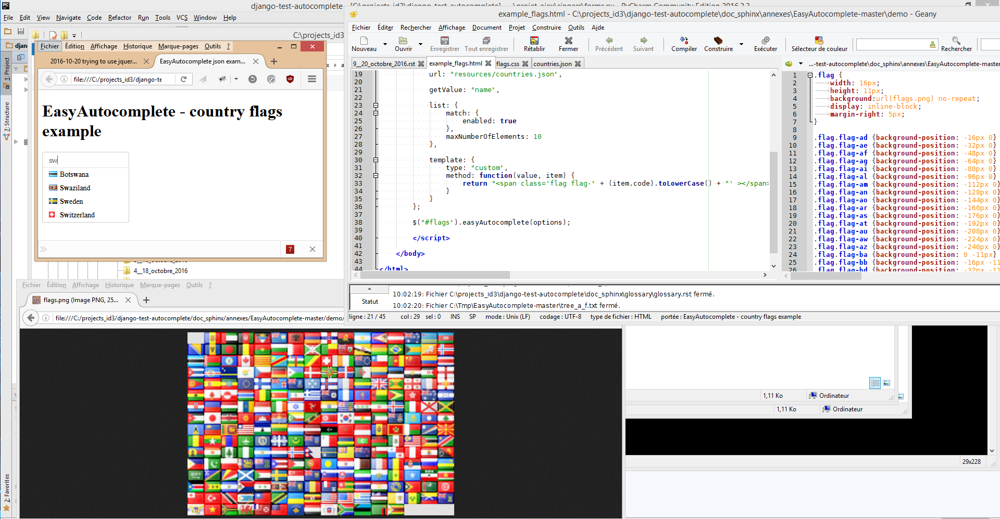
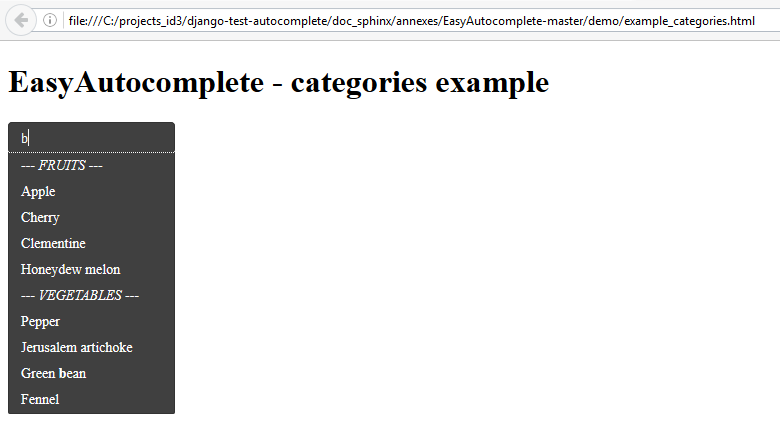
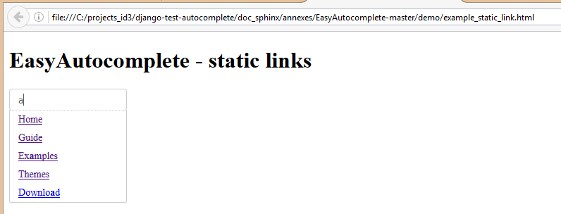
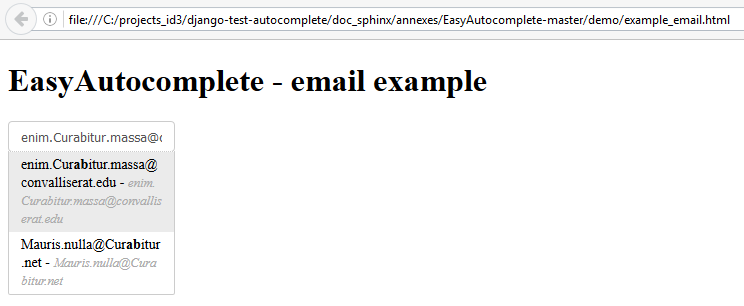
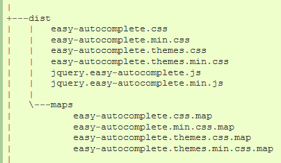

.. index::
   pair: jQuery ; EasyAutocomplete
   pair: plugin ; jQuery EasyAutocomplete
   pair: categories ; EasyAutocomplete
   pair: flags ; EasyAutocomplete
   pair: JSON ; EasyAutocomplete
   pair: Javascript ; EasyAutocomplete
   pair: CSS ; EasyAutocomplete
   pair: SCSS ; EasyAutocomplete

.. _jquery_easyautocomplete:

============================================================================
2016-10-20 trying to use jquery EasyAutocomplete plugin
============================================================================

.. seealso::

   - http://easyautocomplete.com/
   - http://easyautocomplete.com/guide
   - http://easyautocomplete.com/guide#sec-data-providers
   - https://github.com/pawelczak/EasyAutocomplete

.. contents::
   :depth: 5

.. figure:: ../../../eac_favicon.png
   :align: center
   
   

   

Why ? EasyAutocomplete can easily become one of the best autocomplete plugins available for free
================================================================================================

.. seealso:: http://126kr.com/article/69n5fxx65il

Because jquery Easyautocomplete can easily become one of the best autocomplete 
plugins available for free.

   
EasyAutocomplete files tree (Javascript, CSS, JSON, PHP files)
===============================================================
  
::

    C:.
    |   .gitattributes
    |   .gitignore
    |   .jscsrc
    |   .jshintrc
    |   authors.txt
    |   bower.json
    |   Gruntfile.js
    |   LICENSE.txt
    |   package.json
    |   README.md
    |   tree_a_f.txt
    |   
    +---demo
    |   |   example_categories.html
    |   |   example_custom_template.html
    |   |   example_duckduckgo.html
    |   |   example_email.html
    |   |   example_flags.html
    |   |   example_json.html
    |   |   example_remote.html
    |   |   example_simple.html
    |   |   example_static_link.html
    |   |   example_theme.html
    |   |   example_theme_funky.html
    |   |   example_theme_square.html
    |   |   example_xml.html
    |   |   
    |   +---api
    |   |       countries.php
    |   |       countrySearch.php
    |   |       
    |   \---resources
    |           categories.json
    |           countries.json
    |           countries.xml
    |           flags.css
    |           flags.png
    |           icon_search.png
    |           people.json
    |           site.json
    |           
    +---dist
    |   |   easy-autocomplete.css
    |   |   easy-autocomplete.min.css
    |   |   easy-autocomplete.themes.css
    |   |   easy-autocomplete.themes.min.css
    |   |   jquery.easy-autocomplete.js
    |   |   jquery.easy-autocomplete.min.js
    |   |   
    |   \---maps
    |           easy-autocomplete.css.map
    |           easy-autocomplete.min.css.map
    |           easy-autocomplete.themes.css.map
    |           easy-autocomplete.themes.min.css.map
    |           
    +---lib
    |       jquery-1.11.2.min.js
    |       jquery-2.1.3.min.js
    |       
    +---src
    |   |   configuration.js
    |   |   constans.js
    |   |   core.js
    |   |   listBuilder.js
    |   |   logger.js
    |   |   proccessData.js
    |   |   template.js
    |   |   
    |   \---sass
    |           easy-autocomplete.scss
    |           easy-autocomplete.themes.scss
    |           
    \---test
        |   configuration.js
        |   listBuilder.js
        |   modules.html
        |   proccessData.js
        |   template.js
        |   
        +---core
        |   |   build.html
        |   |   build.js
        |   |   categories.html
        |   |   categories.js
        |   |   event.html
        |   |   event.js
        |   |   features.html
        |   |   features.js
        |   |   functions.html
        |   |   functions.js
        |   |   handles.html
        |   |   handles.js
        |   |   plugin.html
        |   |   plugin.js
        |   |   response.html
        |   |   response.js
        |   |   response_json.js
        |   |   response_remote.html
        |   |   response_remote.js
        |   |   response_static.js
        |   |   response_xml.js
        |   |   template.html
        |   |   template.js
        |   |   
        |   +---remote
        |   |       countries.php
        |   |       countrySelectService.php
        |   |       
        |   \---resources
        |       |   categories.json
        |       |   colors.json
        |       |   colors.xml
        |       |   colors_caps_string.json
        |       |   colors_object.json
        |       |   colors_object.xml
        |       |   colors_string.json
        |       |   countries.json
        |       |   duckduckgo.json
        |       |   response.json
        |       |   
        |       \---categories
        |               fruits.json
        |               fruits.xml
        |               otherFruits.xml
        |               
        \---qunit
                qunit.css
                qunit.js
                
  
  
Javascript SCSS and CSS EasyAutocomplete files
===============================================

EasyAutocomplete-master/src/sass/easy-autocomplete.scss
-------------------------------------------------------------------

.. literalinclude:: ../../../annexes/EasyAutocomplete-master/src/sass/easy-autocomplete.scss
   :linenos:
   :caption: EasyAutocomplete-master/src/sass/easy-autocomplete.scss
   
      

EasyAutocomplete-master/dist/easy-autocomplete.css
--------------------------------------------------------------

.. literalinclude:: ../../../annexes/EasyAutocomplete-master/dist/easy-autocomplete.css
   :linenos:
   :language: css
   :caption: EasyAutocomplete-master/dist/easy-autocomplete.css

   
   
EasyAutocomplete-master/dist/jquery.easy-autocomplete.js
-------------------------------------------------------------------

.. literalinclude:: ../../../annexes/EasyAutocomplete-master/dist/jquery.easy-autocomplete.js
   :linenos:
   :language: javascript
   :caption: EasyAutocomplete-master/dist/jquery.easy-autocomplete.js
   

EasyAutocomplete simple example 
================================

   
   
EasyAutocomplete-master/demo/example_simple.html
-------------------------------------------------   
   
.. literalinclude:: ../../../annexes/EasyAutocomplete-master/demo/example_simple.html
   :linenos:
   :language: html
   :caption: EasyAutocomplete-master/demo/example_simple.html

   
EasyAutocomplete JSON example 
==============================

.. seealso:: :term:`JSON`

   
   
EasyAutocomplete-master/demo/example_json.html
----------------------------------------------   
   
.. literalinclude:: ../../../annexes/EasyAutocomplete-master/demo/example_json.html
   :linenos:
   :language: html
   :caption: EasyAutocomplete-master/demo/example_json.html
   
   
EasyAutocomplete-master/demo/resources/countries.json
-----------------------------------------------------   
   
.. literalinclude:: ../../../annexes/EasyAutocomplete-master/demo/resources/countries.json
   :linenos:
   :lines: 1-100
   :language: json
   :caption: EasyAutocomplete-master/demo/resources/countries.json
            
      
   
EasyAutocomplete flags example 
==============================

   

EasyAutocomplete-master/demo/example_flags.html
------------------------------------------------

.. literalinclude:: ../../../annexes/EasyAutocomplete-master/demo/example_flags.html
   :linenos:
   :language: html   
   :caption: EasyAutocomplete-master/demo/example_flags.html
  
  
EasyAutocomplete-master/demo/resources/flags.css
-------------------------------------------------
  
.. literalinclude:: ../../../annexes/EasyAutocomplete-master/demo/resources/flags.css
   :linenos:
   :language: css
   :caption: EasyAutocomplete-master/demo/resources/flags.css
    
    
EasyAutocomplete-master/demo/resources/flags.png
-------------------------------------------------            
        

         
   EasyAutocomplete-master/demo/resources/flags.png
   
         
   
EasyAutocomplete categories example 
====================================

   

EasyAutocomplete-master/demo/example_categories.html
-----------------------------------------------------

.. literalinclude:: ../../../annexes/EasyAutocomplete-master/demo/example_categories.html
   :linenos:
   :language: html
   :caption: EasyAutocomplete-master/demo/example_categories.html
   

EasyAutocomplete-master/demo/resources/categories.json
------------------------------------------------------

.. literalinclude:: ../../../annexes/EasyAutocomplete-master/demo/resources/categories.json
   :linenos:
   :language: html
   :caption: EasyAutocomplete-master/demo/resources/categories.json
   
   
   
EasyAutocomplete static_link example 
======================================
  

   
   
   
EasyAutocomplete-master/demo/example_static_link.html
------------------------------------------------------   

.. literalinclude:: ../../../annexes/EasyAutocomplete-master/demo/example_static_link.html
   :linenos:
   :language: html
   :caption: EasyAutocomplete-master/demo/example_static_link.html
   

EasyAutocomplete-master/demo/resources/site.json
------------------------------------------------

.. literalinclude:: ../../../annexes/EasyAutocomplete-master/demo/resources/site.json
   :linenos:
   :language: json
   :caption: EasyAutocomplete-master/demo/resources/site.json
   
   
EasyAutocomplete email example 
======================================
  

   
   
   
EasyAutocomplete-master/demo/example_email.html
------------------------------------------------------   

.. literalinclude:: ../../../annexes/EasyAutocomplete-master/demo/example_email.html
   :linenos:
   :language: html
   :caption: EasyAutocomplete-master/demo/example_email.html
   

EasyAutocomplete-master/demo/resources/people.json
----------------------------------------------------

.. literalinclude:: ../../../annexes/EasyAutocomplete-master/demo/resources/people.json
   :linenos:
   :language: json
   :lines: 1-200 
   :caption: EasyAutocomplete-master/demo/resources/people.json            
   

EasyAutocomplete Django integration
====================================      
   
.. seealso::

   - http://easyautocomplete.com/guide   
         
      
Include JS and CSS files from the distribution (static files)
---------------------------------------------------------------

.. seealso:: 

   - http://easyautocomplete.com/download
   - https://docs.djangoproject.com/en/dev/howto/static-files/

   

First thing you need to do, is to download EasyAutocomplete plugin files.
 
More information about it can be found in the `Download section`_. 

Javascript and css files(in the actual version) are located in *dist folder* of 
the project. 

.. note:: If you want to make any changes, uncompiled javascript files and 
   unprocessed sass files can be found in the src folder. 

.. _`Download section`:  http://easyautocomplete.com/download
      
   
Exemples of static files in the Django World
=============================================

   
The Django contrib module
--------------------------

::

    C:\PROJECT\PYTHON_ENVS\DJANGO_TEST_AUTOCOMPLETE_35_64\LIB\SITE-PACKAGES\DJANGO\CONTRIB\ADMIN\STATIC
    \---admin
        +---css
        |       base.css
        |       changelists.css
        |       dashboard.css
        |       fonts.css
        |       forms.css
        |       login.css
        |       rtl.css
        |       widgets.css
        |       
        +---fonts
        |       LICENSE.txt
        |       README.txt
        |       Roboto-Bold-webfont.woff
        |       Roboto-Light-webfont.woff
        |       Roboto-Regular-webfont.woff
        |       
        +---img
        |   |   calendar-icons.svg
        |   |   icon-addlink.svg
        |   |   icon-alert.svg
        |   |   icon-calendar.svg
        |   |   icon-changelink.svg
        |   |   icon-clock.svg
        |   |   icon-deletelink.svg
        |   |   icon-no.svg
        |   |   icon-unknown-alt.svg
        |   |   icon-unknown.svg
        |   |   icon-yes.svg
        |   |   inline-delete.svg
        |   |   LICENSE
        |   |   README.txt
        |   |   search.svg
        |   |   selector-icons.svg
        |   |   sorting-icons.svg
        |   |   tooltag-add.svg
        |   |   tooltag-arrowright.svg
        |   |   
        |   \---gis
        |           move_vertex_off.svg
        |           move_vertex_on.svg
        |           
        \---js
            |   actions.js
            |   actions.min.js
            |   calendar.js
            |   cancel.js
            |   change_form.js
            |   collapse.js
            |   collapse.min.js
            |   core.js
            |   inlines.js
            |   inlines.min.js
            |   jquery.init.js
            |   popup_response.js
            |   prepopulate.js
            |   prepopulate.min.js
            |   prepopulate_init.js
            |   SelectBox.js
            |   SelectFilter2.js
            |   timeparse.js
            |   urlify.js
            |   
            +---admin
            |       DateTimeShortcuts.js
            |       RelatedObjectLookups.js
            |       
            \---vendor
                +---jquery
                |       jquery.js
                |       jquery.min.js
                |       LICENSE-JQUERY.txt
                |       
                \---xregexp
                        LICENSE-XREGEXP.txt
                        xregexp.js
                        xregexp.min.js
                    

Django_By_Example_Code/Chapter 1/mysite/blog
---------------------------------------------

The static directory is in the blog **application directory**.

::

    C:\TMP\DJANGO-BY-EXAMPLE-BOOK-MASTER\CHAP_1_BLOG\MYSITE\BLOG
    |   admin.py
    |   apps.py
    |   models.py
    |   tests.py
    |   urls.py
    |   views.py
    |   __init__.py
    |   
    +---migrations
    |       0001_initial.py
    |       __init__.py
    |       
    +---static
    |   \---css
    |           blog.css
    |           
    \---templates
        |   pagination.html
        |   
        \---blog
            |   base.html
            |   pagination.html
            |   
            \---post
                    detail.html
                    list.html
                    pagination.html
                    
                    
  
Django_By_Example_Code/Chapter 8
----------------------------------

There are static directories  in: 

- the courses and shop **applications directory**
- the **project directory**.                        

::

    \---myshop
        |   manage.py
        |   
        +---cart
        |   |   admin.py
        |   |   cart.py

        |               
        +---myshop
        |       celery.py
        |       db.sqlite3
        |       settings.py
        |       urls.py
        |       wsgi.py
        |       __init__.py
        |       
        +---orders
        |   |   admin.py
        |   |   forms.py
        |   |   models.py

        |   |       
        |   +---static
        |   |   \---css
        |   |           admin.css
        |   |           pdf.css
        |   |           

        |               
        +---shop
        |   |   admin.py
        |   |   models.py
        |   |   tests.py
        |   |   urls.py

        |   |       
        |   +---static
        |   |   +---css
        |   |   |       base.css
        |   |   |       
        |   |   \---img
        |   |           no_image.png
        |   |           

        |                   
        \---static
            +---admin
            |   +---css
            |   |       base.css
            |   |       changelists.css
            |   |       dashboard.css
            |   |       forms.css
            |   |       ie.css
            |   |       login.css
            |   |       rtl.css
            |   |       widgets.css
            |   |       
            |   +---img
            |   |   |   changelist-bg.gif
            |   |   |   changelist-bg_rtl.gif
            |   |   |   default-bg-reverse.gif
            |   |   |   default-bg.gif
            |   |   |   deleted-overlay.gif
            |   |   |   icon-no.gif
            |   |   |   icon-unknown.gif
            |   |   |   icon-yes.gif
            |   |   |   icon_addlink.gif
            |   |   |   icon_alert.gif
            |   |   |   icon_calendar.gif
            |   |   |   icon_changelink.gif
            |   |   |   icon_clock.gif
            |   |   |   icon_deletelink.gif
            |   |   |   icon_error.gif
            |   |   |   icon_searchbox.png
            |   |   |   icon_success.gif
            |   |   |   inline-delete-8bit.png
            |   |   |   inline-delete.png
            |   |   |   inline-restore-8bit.png
            |   |   |   inline-restore.png
            |   |   |   inline-splitter-bg.gif
            |   |   |   nav-bg-grabber.gif
            |   |   |   nav-bg-reverse.gif
            |   |   |   nav-bg-selected.gif
            |   |   |   nav-bg.gif
            |   |   |   selector-icons.gif
            |   |   |   selector-search.gif
            |   |   |   sorting-icons.gif
            |   |   |   tooltag-add.png
            |   |   |   tooltag-arrowright.png
            |   |   |   
            |   |   \---gis
            |   |           move_vertex_off.png
            |   |           move_vertex_on.png
            |   |           
            |   \---js
            |       |   actions.js
            |       |   actions.min.js
            |       |   calendar.js
            |       |   collapse.js
            |       |   collapse.min.js
            |       |   core.js
            |       |   inlines.js
            |       |   inlines.min.js
            |       |   jquery.init.js
            |       |   jquery.js
            |       |   jquery.min.js
            |       |   LICENSE-JQUERY.txt
            |       |   prepopulate.js
            |       |   prepopulate.min.js
            |       |   related-widget-wrapper.js
            |       |   SelectBox.js
            |       |   SelectFilter2.js
            |       |   timeparse.js
            |       |   urlify.js
            |       |   
            |       \---admin
            |               DateTimeShortcuts.js
            |               RelatedObjectLookups.js
            |               
            +---css
            |       admin.css
            |       base.css
            |       pdf.css
            |       
            \---img
                    no_image.png
                
   
   
Django_By_Example_Code/Chapter 13
----------------------------------

There are static directories  in: 

- the courses **application directory**
- the **project directory**.

                    
::

    \---educa
        |   db.sqlite3
        |   manage.py
        |   
        +---config
        |       nginx.conf
        |       uwsgi.ini
        |       
        +---courses
        |   |   admin.py
        |   |   fields.py
        |   |   forms.py

        |   |       
        |   +---static
        |   |   \---css
        |   |           base.css
        |   |           

        |           
        +---educa
        |   |   db.sqlite3
        |   |   urls.py
        |   |   wsgi.py
        |   |   __init__.py
        |   |   
        |   \---settings
        |           base.py
        |           local.py
        |           pro.py
        |           __init__.py
        |           
        +---ssl
        |       educa.crt
        |       educa.key
        |       
        +---static
        |   +---admin
        |   |   +---css
        |   |   |       base.css
        |   |   |       changelists.css
        |   |   |       dashboard.css
        |   |   |       forms.css
        |   |   |       ie.css
        |   |   |       login.css
        |   |   |       rtl.css
        |   |   |       widgets.css
        |   |   |       
        |   |   +---img
        |   |   |   |   changelist-bg.gif
        |   |   |   |   changelist-bg_rtl.gif
        |   |   |   |   default-bg-reverse.gif
        |   |   |   |   default-bg.gif
        |   |   |   |   deleted-overlay.gif
        |   |   |   |   icon-no.gif
        |   |   |   |   icon-unknown.gif
        |   |   |   |   icon-yes.gif
        |   |   |   |   icon_addlink.gif
        |   |   |   |   icon_alert.gif
        |   |   |   |   icon_calendar.gif
        |   |   |   |   icon_changelink.gif
        |   |   |   |   icon_clock.gif
        |   |   |   |   icon_deletelink.gif
        |   |   |   |   icon_error.gif
        |   |   |   |   icon_searchbox.png
        |   |   |   |   icon_success.gif
        |   |   |   |   inline-delete-8bit.png
        |   |   |   |   inline-delete.png
        |   |   |   |   inline-restore-8bit.png
        |   |   |   |   inline-restore.png
        |   |   |   |   inline-splitter-bg.gif
        |   |   |   |   nav-bg-grabber.gif
        |   |   |   |   nav-bg-reverse.gif
        |   |   |   |   nav-bg-selected.gif
        |   |   |   |   nav-bg.gif
        |   |   |   |   selector-icons.gif
        |   |   |   |   selector-search.gif
        |   |   |   |   sorting-icons.gif
        |   |   |   |   tooltag-add.png
        |   |   |   |   tooltag-arrowright.png
        |   |   |   |   
        |   |   |   \---gis
        |   |   |           move_vertex_off.png
        |   |   |           move_vertex_on.png
        |   |   |           
        |   |   \---js
        |   |       |   actions.js
        |   |       |   actions.min.js
        |   |       |   calendar.js
        |   |       |   collapse.js
        |   |       |   collapse.min.js
        |   |       |   core.js
        |   |       |   inlines.js
        |   |       |   inlines.min.js
        |   |       |   jquery.init.js
        |   |       |   jquery.js
        |   |       |   jquery.min.js
        |   |       |   LICENSE-JQUERY.txt
        |   |       |   prepopulate.js
        |   |       |   prepopulate.min.js
        |   |       |   related-widget-wrapper.js
        |   |       |   SelectBox.js
        |   |       |   SelectFilter2.js
        |   |       |   timeparse.js
        |   |       |   urlify.js
        |   |       |   
        |   |       \---admin
        |   |               DateTimeShortcuts.js
        |   |               RelatedObjectLookups.js
        |   |               
        |   +---css
        |   |       base.css
        |   |       
        |   \---rest_framework
        |       +---css
        |       |       bootstrap-tweaks.css
        |       |       bootstrap.min.css
        |       |       default.css
        |       |       prettify.css
        |       |       
        |       +---fonts
        |       |       glyphicons-halflings-regular.eot
        |       |       glyphicons-halflings-regular.svg
        |       |       glyphicons-halflings-regular.ttf
        |       |       glyphicons-halflings-regular.woff
        |       |       
        |       +---img
        |       |       glyphicons-halflings-white.png
        |       |       glyphicons-halflings.png
        |       |       grid.png
        |       |       
        |       \---js
        |               bootstrap.min.js
        |               default.js
        |               jquery-1.8.1-min.js
        |               prettify-min.js
        |               

Django settings example
========================

.. seealso::

   - https://docs.djangoproject.com/en/dev/ref/settings/#settings-staticfiles
   
   
::   

    # Build paths inside the project like this: os.path.join(BASE_DIR, ...)
    BASE_DIR = os.path.dirname(os.path.dirname(os.path.abspath(__file__)))

    # https://docs.djangoproject.com/en/dev/howto/static-files/
    STATIC_URL = '/static/'
    STATIC_ROOT = os.path.join(BASE_DIR, 'static/')

Integration in our Django test project
=======================================

::

    +---static
    |   +---css
    |   |       easy-autocomplete.min.css
    |   |       easy-autocomplete.themes.min.css
    |   |       
    |   \---js
    |           jquery.easy-autocomplete.min.js

::

    |   ajax_selects_singers_db
    |   manage.py
    |   run_local_dev_server.bat
    |   
    +---projects
    |   |   admin.py
    |   |   apps.py
    |   |   forms.py
    |   |   models.py
    |   |   tests.py
    |   |   urls.py
    |   |   views.py
    |   |   __init__.py
    |   |   
    |   +---migrations
    |   |   |   0001_initial.py
    |   |   |   __init__.py
    |   |   |   

    |   +---templates
    |   |   \---projects
    |   |       \---project
    |   |               update.html
    |   |               

    |           
    +---projet_ajax
    |   |   settings.py
    |   |   urls.py
    |   |   wsgi.py
    |   |   __init__.py
    |   |   
    |           
    +---singers
    |   |   admin.py
    |   |   apps.py
    |   |   forms.py
    |   |   lookups.py
    |   |   models.py
    |   |   tests.py
    |   |   urls.py
    |   |   views.py
    |   |   __init__.py
    |   |   
    |   +---migrations
    |   |   |   0001_initial.py
    |   |   |   0002_auto_20161017_1612.py
    |   |   |   0003_auto_20161017_1632.py
    |   |   |   __init__.py
    |   |   |   

    |   |           
    |   +---templates
    |   |   \---singers
    |   |       +---author
    |   |       |       update.html
    |   |       |       
    |   |       +---book
    |   |       |       update.html
    |   |       |       
    |   |       \---song
    |   |               update.html
    |   |               

    |           
    +---static
    |   +---css
    |   |       easy-autocomplete.min.css
    |   |       easy-autocomplete.themes.min.css
    |   |       
    |   \---js
    |           jquery.easy-autocomplete.min.js
    |           
    \---templates
            base.html
            search_form.html
       

Create a simple update_easy.html with 
========================================  

