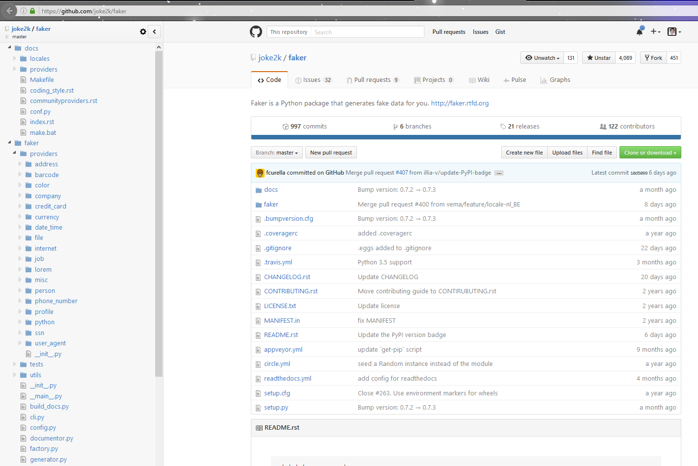

.. index::
   pair: Faker ; Python 

.. _faker:

=====================
Python faker module 
=====================

.. seealso::

   - https://github.com/joke2k/faker
   - https://faker.readthedocs.io/en/master/
   - http://blog.districtdatalabs.com/a-practical-guide-to-anonymizing-datasets-with-python-faker

   
   
Description
============

Faker is a Python package that generates fake data for you. Whether you need to 
bootstrap your database, create good-looking XML documents, fill-in your 
persistence to stress test it, or anonymize data taken from a production service, 
Faker is for you.   

install
=======

::

    (django_test_autocomplete_35_64) C:\projects_id3\django-test-autocomplete>pip install faker
    
::
    
    Collecting faker
      Downloading Faker-0.7.3-py2.py3-none-any.whl (529kB)
        100% |################################| 532kB 1.2MB/s
    Requirement already satisfied (use --upgrade to upgrade): six in c:\project\python_envs\django_test_autocomplete_35_64\lib\site-packages (from faker)
    Requirement already satisfied (use --upgrade to upgrade): python-dateutil>=2.4 in c:\project\python_envs\django_test_autocomplete_35_64\lib\site-packages (from faker)
    Installing collected packages: faker
    Successfully installed faker-0.7.3

Test
=====

.. seealso::

   - https://docs.djangoproject.com/eb/dev/ref/contrib/auth/
   - https://faker.readthedocs.io/en/master/providers/faker.providers.internet.html
   - https://faker.readthedocs.io/en/master/providers/faker.providers.person.html

Les attributs principaux de l’utilisateur par défaut sont :

- username
- password
- email
- first_name
- last_name

::

    (django_test_autocomplete_35_64) C:\projects_id3\django-test-autocomplete>faker address
    
::
    
    042 Wilson Isle
    Port Alan, MT 63548-2890
    

    from faker import Factory 

    for lang in ['dk_DK', 'en_GB', 'fa_IR', 'it_IT', 'es_ES']:
        fake=Factory.create(lang)
        for _ in range(20):
            first_name = fake.first_name_female()
            last_name = fake.last_name()
            username = '{}_{}'.format(first_name, last_name)
            email =  '{}_{}@{}'.format(first_name, 
                                       last_name,
                                       fake.free_email_domain())
            female=User.objects.get_or_create(username=username,
                                              first_name=first_name,
                                              last_name=last_name,
                                              email=email,
                                              password='1234')
   

::

    In [18]: User.objects.count()
    Out[18]: 11

    In [19]:     fake=Factory.create('fr_FR')
        ...:     for _ in range(20):
        ...:         first_name = fake.first_name_female()
        ...:         last_name = fake.last_name()
        ...:         username = '{}_{}'.format(first_name, last_name)
        ...:         email =  '{}_{}@{}'.format(first_name,
        ...:                                    last_name,
        ...:                                    fake.free_email_domain())
        ...:         female=User.objects.get_or_create(username=username,
        ...:                                           first_name=first_name,
        ...:                                           last_name=last_name,
        ...:                                           email=email,
        ...:                                           password='1234')
        ...:

    In [20]: User.objects.count()
    Out[20]: 31   

    for lang in ['dk_DK', 'en_GB', 'fa_IR', 'it_IT', 'es_ES']:
        fake=Factory.create(lang)
        for _ in range(20):
            first_name = fake.first_name_male()
            last_name = fake.last_name()
            username = '{}_{}'.format(first_name, last_name)
            email =  '{}_{}@{}'.format(first_name, 
                                       last_name,
                                       fake.free_email_domain())
            female=User.objects.get_or_create(username=username,
                                              first_name=first_name,
                                              last_name=last_name,
                                              email=email,
                                              password='1234')
                
                

::

    In [24]:     for lang in ['dk_DK', 'en_GB', 'fa_IR', 'it_IT', 'es_ES']:
        ...:         fake=Factory.create(lang)
        ...:         for _ in range(20):
        ...:             first_name = fake.first_name_female()
        ...:             last_name = fake.last_name()
        ...:             username = '{}_{}'.format(first_name, last_name)
        ...:             email =  '{}_{}@{}'.format(first_name,
        ...:                                        last_name,
        ...:                                        fake.free_email_domain())
        ...:             female=User.objects.get_or_create(username=username,
        ...:                                               first_name=first_name,
        ...:                                               last_name=last_name,
        ...:                                               email=email,
        ...:                                               password='1234')
        ...:

    In [25]: User.objects.count()
    Out[25]: 151                                          
                                          

::

    In [26]:     for lang in ['dk_DK', 'en_GB', 'fa_IR', 'it_IT', 'es_ES']:
        ...:         fake=Factory.create(lang)
        ...:         for _ in range(20):
        ...:             first_name = fake.first_name_male()
        ...:             last_name = fake.last_name()
        ...:             username = '{}_{}'.format(first_name, last_name)
        ...:             email =  '{}_{}@{}'.format(first_name,
        ...:                                        last_name,
        ...:                                        fake.free_email_domain())
        ...:             female=User.objects.get_or_create(username=username,
        ...:                                               first_name=first_name,
        ...:                                               last_name=last_name,
        ...:                                               email=email,
        ...:                                               password='1234')
        ...:

    In [27]: User.objects.count()
    Out[27]: 251

::

    from faker import Factory 
    for lang in ['nl_NL', 'cs_CZ', 'el_GR', 'fi_FI', 'sv_SE']:
        fake=Factory.create(lang)
        for _ in range(20):
            first_name = fake.first_name_female()
            last_name = fake.last_name()
            username = '{}_{}'.format(first_name, last_name)
            email =  '{}_{}@{}'.format(first_name, 
                                       last_name,
                                       fake.free_email_domain())
            female=User.objects.get_or_create(username=username,
                                              first_name=first_name,
                                              last_name=last_name,
                                              email=email,
                                              password='1234')
