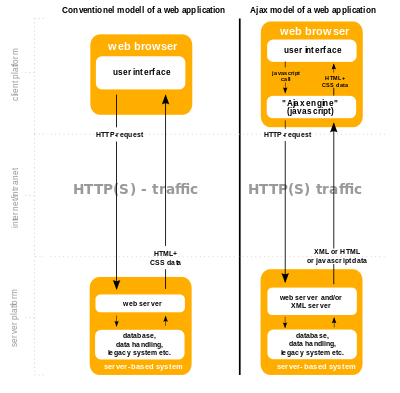

.. index::
   pair: Project ; Django AJAX autocomplete 

.. _django_test_ajax_autocomplete:

=======================================================================
Dango project for testing AJAX autocomplete plugins 
=======================================================================

.. seealso::

   - https://en.wikipedia.org/wiki/Ajax_(programming)
   - https://en.wikipedia.org/wiki/JSON

.. sidebar:: Dango test AJAX autocomplete

    :Projet: Dango test AJAX autocomplete
    :Release: |release|
    :Date: |today|
    :Authors: **pvergain**
    
    - :ref:`genindex`
    - :ref:`search` 
    - :ref:`glossary`
 

   
   :term:`AJAX` source: https://en.wikipedia.org/wiki/Ajax_(programming)

  

   
   :term:`JSON` logo (https://en.wikipedia.org/wiki/JSON)
   

   
   httpie logo (https://httpie.org/)
   

.. toctree::
   :maxdepth: 5
   
   introduction/introduction
   actions/actions
   dev/dev
   glossary/glossary

