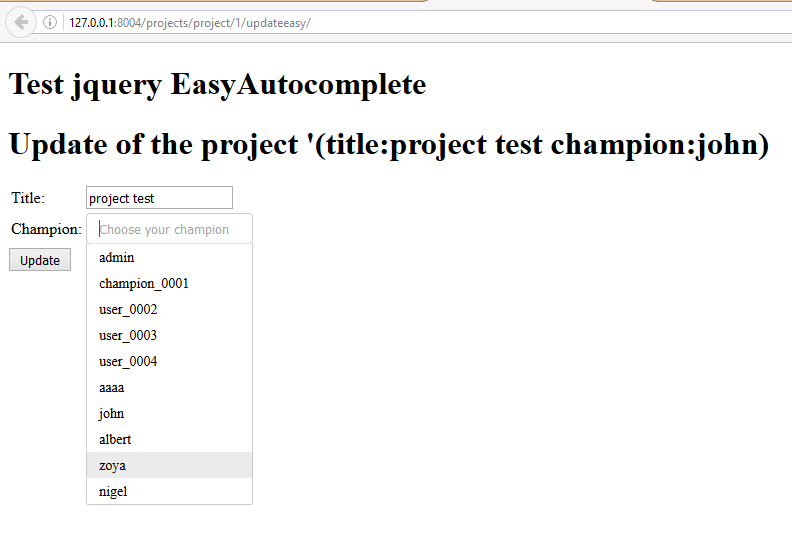
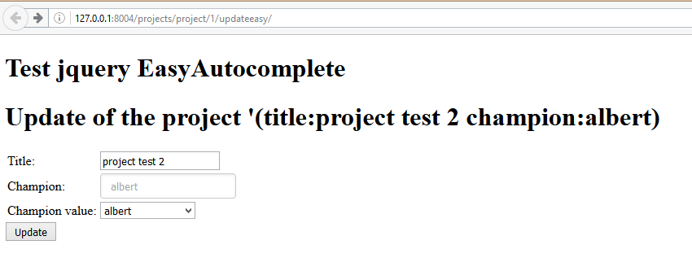
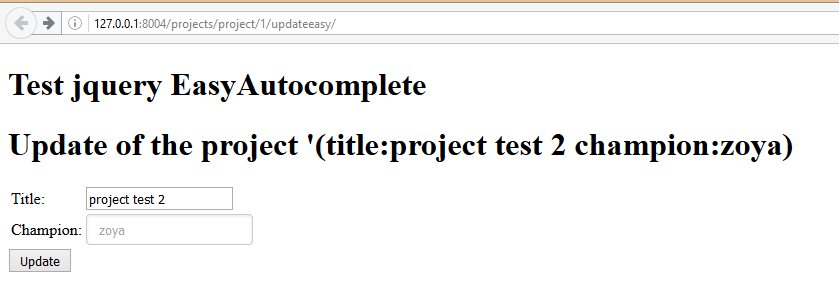

.. index::
   pair: Tests ; easyautocomplete 

.. _easyautocomplete_tests:

=============================
jQuery EasyAutocomplete test
=============================

.. contents::
   :depth: 3
   
 
 

Running the local Django web server
====================================

::

    System check identified no issues (0 silenced).
    October 24, 2016 - 10:41:29
    Django version 1.10.2, using settings 'projet_ajax.settings'
    Starting development server at http://127.0.0.1:8004/
    Quit the server with CTRL-BREAK. 
     
   
Testing the JSON API view
=========================

::

    http://127.0.0.1:8004/projects/api_get_champions/?term=a   
    
    
::

    [{"id": 6, "value": "aaaa", "label": "aaaa"}, 
    {"id": 1, "value": "admin", "label": "admin"}, 
    {"id": 8, "value": "albert", "label": "albert"}, 
    {"id": 2, "value": "champion_0001", "label": "champion_0001"}, 
    {"id": 7, "value": "john", "label": "john"}, 
    {"id": 10, "value": "nigel", "label": "nigel"}, 
    {"id": 9, "value": "zoya", "label": "zoya"}]  
      

Testing the form, step1 
========================

::

    http://127.0.0.1:8004/projects/project/1/updateeasy
     

projects/urls.py
-----------------

::

    url(r'^project/(?P<pk>\d+)/updateeasy/$',
        ProjectUpdateViewEasyAutoComplete.as_view(),
        name='project_update_easy'),

The forms.py part
------------------

.. code-block:: python

    #!/usr/bin/python
    # -*- coding: utf8 -*-
    """The project's forms.

    """

    from django import forms

    from .models import Project

    class ProjectChampionForm(forms.ModelForm):
        """The champion project form"""
        champions_choice_list = forms.CharField(max_length=100,
                                           help_text='type username or email')

        class Meta:
            model = Project
            fields = ('title',
                      'champions_choice_list', 'champion',)

        def __init__(self, *args, **kwargs):
            super(ProjectChampionForm, self).__init__(*args, **kwargs)
            self.fields['champions_choice_list'].label = "Update the champion"
            self.fields['champion'].widget = forms.HiddenInput()

The HTML and JavaScript part
-----------------------------

::

    <body>

            <!-- STRUCTURE -> HTML5 elements -->
                <h1>Test jquery EasyAutocomplete</h1>
                <h1>Update of the project '(title:{{ project.title }} champion:{{ project.champion }}) </h1>
                

                

                {# https://docs.djangoproject.com/en/dev/topics/forms/ #}
                <form id="id_form_project_update_easy" action="" method="post">
                    
                    

                        {{ form.id }}
                        {{ form.non_field_errors }}
                        {# Include the hidden fields #}
                        
                            {# here we will have the champion filed (which is hidden) #}
                            {{ hidden }}
                        
                        <table id="id_table" class="table table-hover table-bordered table-condensed">
                            <tbody>
                                    <tr>
                                        <td class="text-right">Title:</td>
                                        <td>{{ form.title }}</td>
                                    </tr>
                                    <tr>
                                        <td class="text-right">Champion:</td>
                                        <td> {{ form.champions_choice_list }}  </td>
                                    </tr>
                            </tbody>
                        </table>
                    

                    <input type="submit" name="btn_update"  value="Update" class="btn btn-success btn-block" />
                </form>
            <!-- end STRUCTURE-->

            <!--BEHAVIOR -> Javascript scripts-->
                <!-- Using jQuery with a CDN -->
                
                

                
            <!-- end BEHAVIOR -->

        </body>

Step2 : initialize the easyAutocomplete placeholder with the value of champion
==============================================================================

Add these jQuery lines::

    {# build the autocomplete list for the champions_choice_list #}
    $("#id_champions_choice_list").easyAutocomplete(options_easy_autocomplete_champions);
    {# Get the value of the former champion (from database) #}
    {# Thanks http://stackoverflow.com/questions/1643227/get-selected-text-from-a-drop-down-list-select-box-using-jquery #}
    var champion_name = $("#id_champion option:selected").text();
    {# replace the placeholder by the value coming from database #}
    $("#id_champions_choice_list").attr('placeholder', champion_name);
    
    

Step3 : hide the select champion form field
============================================
   
Before the update   
-------------------
   
in the HTML file::

    <td class="text-right">Champion value:</td>
    <td> <select id="id_champion" name="champion" required>
    <option value="">---------</option>
    <option value="1">admin</option>
    <option value="2">champion_0001</option>
    <option value="3">user_0002</option>
    <option value="4">user_0003</option>
    <option value="5">user_0004</option>
    <option value="6">aaaa</option>
    <option value="7">john</option>
    <option value="8">albert</option>
    <option value="9" selected="selected">zoya</option>
    <option value="10">nigel</option>
    </select>  
  
    
in the projects/forms.py file::
    
    
    def __init__(self, *args, **kwargs):
        super(ProjectChampionForm, self).__init__(*args, **kwargs)
        self.fields['champions_choice_list'].label = "Update the champion"
        # self.fields['champion'].widget = forms.HiddenInput()    
    

After the update   
----------------

in the projects/forms.py file::

    def __init__(self, *args, **kwargs):
        super(ProjectChampionForm, self).__init__(*args, **kwargs)
        self.fields['champions_choice_list'].label = "Update the champion"
        self.fields['champion'].widget = forms.HiddenInput()    
    
    
New jQuery lines::    

    {# build the autocomplete list for the champions_choice_list #}
    $("#id_champions_choice_list").easyAutocomplete(options_easy_autocomplete_champions);

    var champion_name = "{{ project.champion.username }}"
    $("#id_champions_choice_list").attr('placeholder', champion_name);

