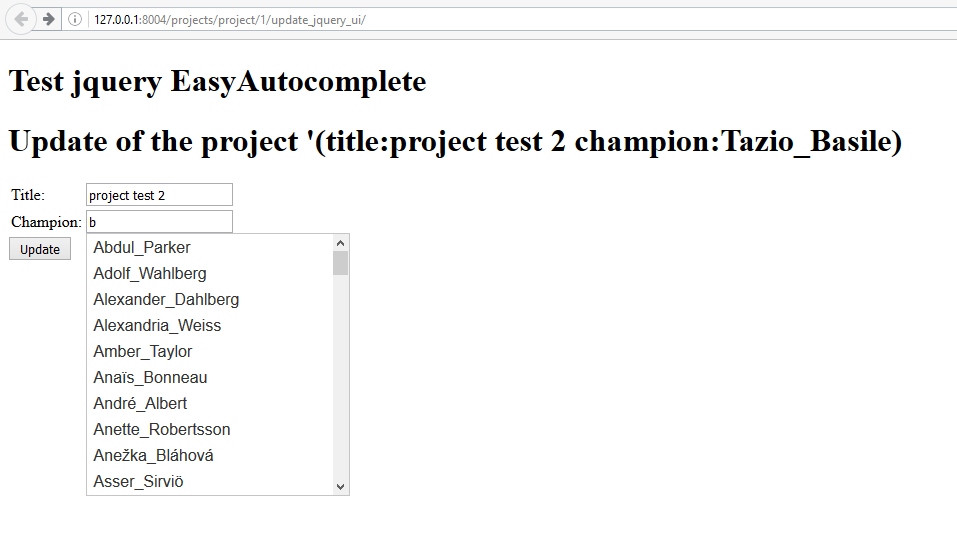

.. index::
   pair: Tests ; jQuery UI autocomplete 
   pair: scrollbar ; jQuery UI autocomplete 

.. _jquery_ui_autocomplete:

=============================
jQuery UI autocomplete test
=============================

.. seealso::

   - https://jqueryui.com/autocomplete/
   - https://github.com/jquery/jquery-ui/tree/master/demos
   - https://github.com/jquery/jquery-ui/blob/master/demos/autocomplete/maxheight.html
   - https://www.npmjs.com/package/jquery-ui.autocomplete.scroll
   - https://github.com/anseki/jquery-ui-autocomplete-scroll
   

.. contents::
   :depth: 3
   

   
   jQuery UI with scrollbar (thanks https://github.com/anseki)
   

Running the local Django web server
====================================

::

    System check identified no issues (0 silenced).
    October 26, 2016 - 08:54:53
    Django version 1.10.2, using settings 'projet_ajax.settings'
    Starting development server at http://127.0.0.1:8004/
    Quit the server with CTRL-BREAK. 
         
   

The projects/forms.py module
=============================

.. code-block:: python

    #!/usr/bin/python
    # -*- coding: utf8 -*-
    """The project's forms.

    """

    from django import forms

    from .models import Project

    class ProjectChampionForm(forms.ModelForm):
        """The champion project form"""
        champions_choice_list = forms.CharField(max_length=100,
                                           help_text='type username or email')

        class Meta:
            model = Project
            fields = ('title',
                      'champions_choice_list', 'champion',)

        def __init__(self, *args, **kwargs):
            super(ProjectChampionForm, self).__init__(*args, **kwargs)
            self.fields['champions_choice_list'].label = "Update the champion"
            self.fields['champion'].widget = forms.HiddenInput()

The HTML and JavaScript part (the Django Template)
====================================================

.. code-block:: Django

    
    

    <!DOCTYPE html>
    <html lang="en">
        <head>
            <title>jQuery UI complete simple example</title>

            <!-- STYLE -> CSS -->
            {# https://jqueryui.com/autocomplete/ #}
            <link rel="stylesheet" href="//code.jquery.com/ui/1.12.1/themes/base/jquery-ui.css" type="text/css">
            <!-- end STYLE-->

        </head>
        <body>

            <!-- STRUCTURE -> HTML5 elements -->
                <h1>Test jquery EasyAutocomplete</h1>
                <h1>Update of the project '(title:{{ project.title }} champion:{{ project.champion.username }}) </h1>
                

                

                {# https://docs.djangoproject.com/en/dev/topics/forms/ #}
                <form id="id_form_project_update_easy" action="" method="post">
                    
                    

                        {{ form.id }}
                        {{ form.non_field_errors }}
                        {# Include the hidden fields #}
                        
                            {# here we will have the champion filed (which is hidden) #}
                            {{ hidden }}
                        
                        <table id="id_table" class="table table-hover table-bordered table-condensed">
                            <tbody>
                                    <tr>
                                        <td class="text-right">Title:</td>
                                        <td>{{ form.title }}</td>
                                    </tr>
                                    <tr>
                                        <td class="text-right">Champion:</td>
                                        <td> {{ form.champions_choice_list }}  </td>
                                    </tr>
                            </tbody>
                        </table>
                    

                    <input type="submit" name="btn_update"  value="Update" class="btn btn-success btn-block" />
                </form>
            <!-- end STRUCTURE-->

            <!--BEHAVIOR -> Javascript scripts-->
                <!-- Using jQuery with a CDN -->
                
                
                {# https://github.com/anseki/jquery-ui-autocomplete-scroll #}
                
                
            <!-- end BEHAVIOR -->

        </body>

    </html>

The projects/views.py module
=============================

.. code-block:: python

    class ProjectUpdateViewJQueryUIAutoComplete(UpdateView):
        """Update the view with the jQuery UI Autocomplete plugin.

        Documentation:

        - http://ccbv.co.uk/projects/Django/1.10/django.views.generic.edit/UpdateView/

        """
        model = Project
        form_class = ProjectChampionForm
        context_object_name = 'project'
        template_name = 'projects/project/update_jquery_ui_autocomplete.html'

        def get_object(self, queryset=None):
            """Pour mémoriser self.demande_article"""
            self.object = super(ProjectUpdateViewJQueryUIAutoComplete, self).get_object(queryset)
            return self.object

        def post(self, request, *args, **kwargs):
            logger.warning("Hello from ProjectUpdateViewJQueryUIAutoComplete !")
            return super(ProjectUpdateViewJQueryUIAutoComplete, self).post(request, *args, **kwargs)

The projects/urls.py module
=============================

.. code-block:: python

    urlpatterns = [
         url(r'^project/(?P<pk>\d+)/update/$',
             ProjectUpdateView.as_view(),
             name='project_update'),

        url(r'^project/(?P<pk>\d+)/updateeasy/$',
            ProjectUpdateViewEasyAutoComplete.as_view(),
            name='project_update_easy'),

        url(r'^project/(?P<pk>\d+)/update_jquery_ui/$',
            ProjectUpdateViewJQueryUIAutoComplete.as_view(),
            name='project_update_jquery_ui'),

The jQuery UI scrollbar module
===============================

.. seealso:: :ref:`jquery_ui_autocomplete_scroll`

