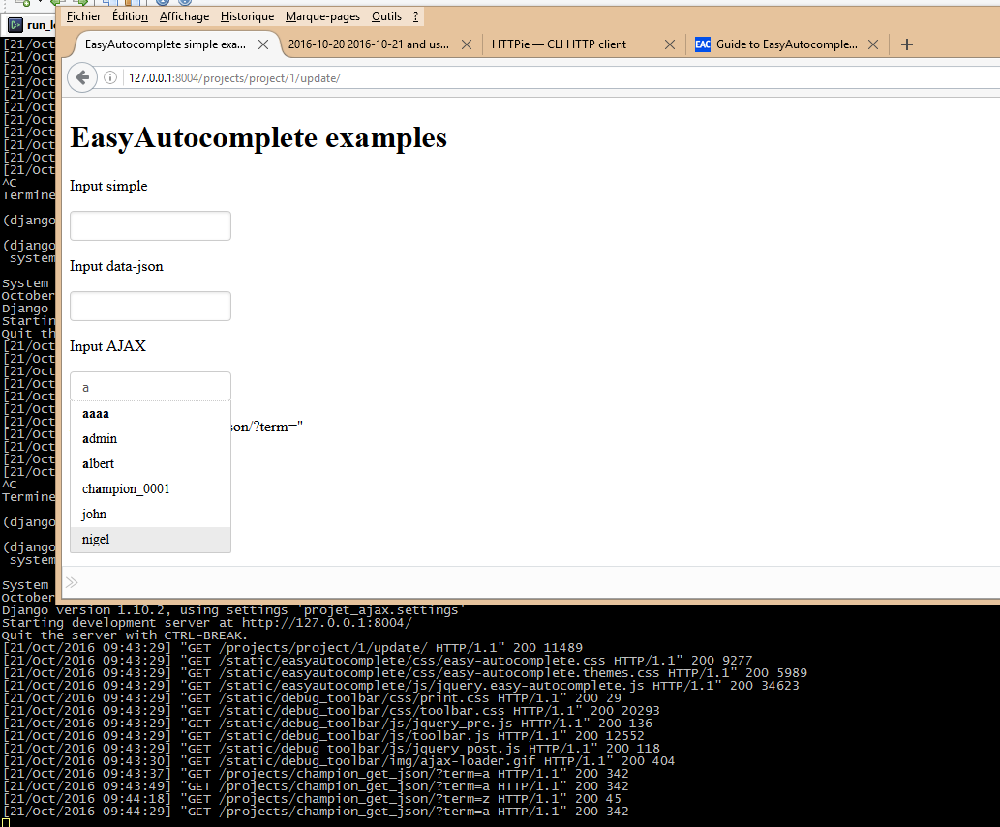

.. index::
   pair: Version ; 0.1.0 (2016-10-21)

.. _version_0_1_0:

===========================
Version 0.1.0 (2016-10-21)
===========================

.. seealso::

   - http://keepachangelog.com

   

::

    git tag 0.1.0
    git push origin --tags   

Added
======

.. seealso:: 

   - :ref:`adding_ajax_call`

This is the First version !

The best autocomplete jquery plugin for the non-admin Django is the jquery 
EasyAutocomplete plugin

Changed
========
  

Miscellaneous 
=============

Fixed
======

Test 
=====
