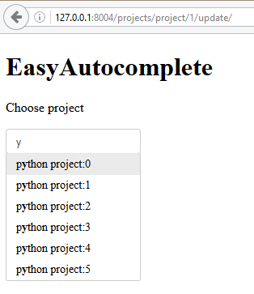
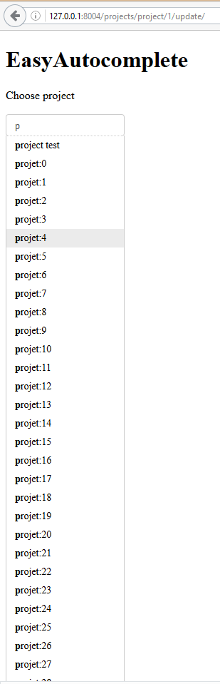
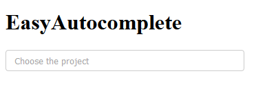

.. index::
   pair: placeholder ; HTML5
   

.. _eac_ajax_options:

======================================================================================
2016-10-21 testing the jquery EasyAutocomplete (EAC) options for an AJAX call
======================================================================================

.. contents::
   :depth: 3

Renaming views
==============

Rename champion_get_json into api_get_champions

Add a great number of projects into the 'project' table
========================================================

.. seealso::

   - https://github.com/fcurella/django-fakery
   - http://blog.districtdatalabs.com/a-practical-guide-to-anonymizing-datasets-with-python-faker

We can create a Django command or a simple loop in the command line interface.

::

    user = User.objects.last()

::

    for i in range(20):
        title='python project:{}'.format(i)
        p = Project.objects.create(champion=user, title=title)
        print(p)
       

Write an API view/urls to select projects
==========================================

The view
--------

::

    class ApiGetProjectsView(FormView):
        """
        Documentation
        =============

        - https://ccbv.co.uk/projects/Django/1.10/django.views.generic.edit/FormView/

        """
        def get(self, request, *args, **kwargs):
            """term is sent by the jquery-ui autocomplete widget.

            For the jquery-ui autocomplete widget we have to return 3 fields:

            - id
            - label
            - value

            For the jquery EasyAutocomplete we can return what we want.

            """
            term = request.GET.get("term")
            if term:
                projects = Project.objects.filter(title__icontains=term)
            else:
                projects = Project.objects.all()[:50]

            results = []
            for project in projects:
                project_json = {}
                project_json['id'] = project.id
                project_json['label'] = project.title
                project_json['value'] = project.title 
                results.append(project_json)

            data = json.dumps(results)
            mimetype = 'application/json'
            return HttpResponse(data, mimetype)

The URL
--------

::

    # calls by jquery EasyAutocomplete (EAC)
    # http://127.0.0.1:8004/projects/api_get_projects/?term=a
    url(r'^api_get_projects/$',
        ApiEACGetProjectsView.as_view(),
        name='api_get_projects'),
        
        
Tests with httpie
------------------

::

    http http://127.0.0.1:8004/projects/api_get_projects/?term=a
    
    
::

    HTTP/1.0 200 OK
    Content-Type: application/json
    Date: Fri, 21 Oct 2016 13:03:31 GMT
    Server: WSGIServer/0.2 CPython/3.5.2
    X-Frame-Options: SAMEORIGIN

    [
        {
            "id": 52,
            "label": "an other projec:0",
            "value": "an other projec:0"
        },
        {
            "id": 53,
            "label": "an other projec:1",
            "value": "an other projec:1"
        },
        {
            "id": 54,
            "label": "an other projec:2",
            "value": "an other projec:2"
        },    
          

Update the Django template file in order to call this view
===========================================================

::

    

   
   
6 elements is not enough
=========================

OK, no slider 

   
   
   
Ajout placeholder
==================

::

    <!-- STRUCTURE -> HTML5 elements -->
        <h1>EasyAutocomplete</h1>

        <input id="data-ajax" placeholder="Choose the project" size="50" />
    <!-- end STRUCTURE-->
    

   
   
list['onSelectItemEvent']
===========================

.. seealso:: http://easyautocomplete.com/guide#sec-function-selected-data

HTML5
------

::

        <!-- STRUCTURE -> HTML5 elements -->
            <h1>EasyAutocomplete</h1>

            <input id="project_choice_list" placeholder="Choose the project" size="50" />
            <input id="projet_holder" type="text" value="" size="50">
        <!-- end STRUCTURE-->

Javascript
-----------

.. code-block:: html

    var options_easy_autocomplete_ajax = {
        {# we have to build this URL: http://127.0.0.1:8004/projects/api_get_projects/?term=a #}
        url: function(term) {
            return "" + "?term=" + term;
        },
        getValue: "title",
        list: {
            maxNumberOfElements: 200,
            onSelectItemEvent: function() {
                var project_id = $("#project_choice_list").getSelectedItemData().id;

                {# put the project.id in the projet_holder field #}
                $("#projet_holder").val(project_id).trigger("change");
            },
            match: {
                enabled: true
            },
        },
    };
    $("#project_choice_list").easyAutocomplete(options_easy_autocomplete_ajax);
        
    

list['showAnimation']
======================

TODO : tester categories
=========================

.. seealso::

   - http://easyautocomplete.com/guide#sec-categories
   
   

   
