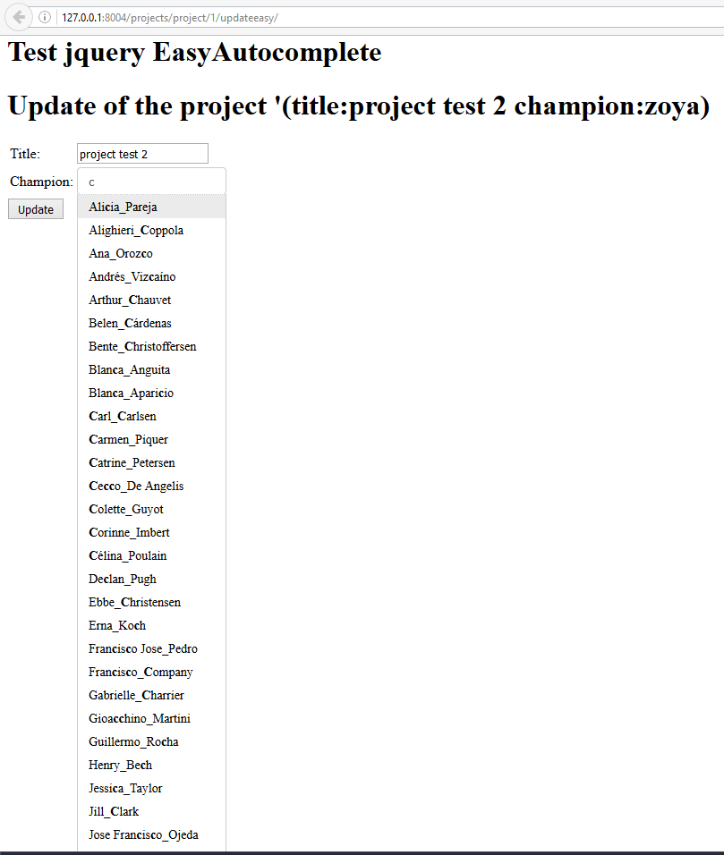

.. index::
   pair: Python ; Faker
   

.. _faker_ref:

==============================================================================
2016-10-25 Building fake users with the Python faker module
==============================================================================

.. seealso::

   - :ref:`faker`
   - http://blog.districtdatalabs.com/a-practical-guide-to-anonymizing-datasets-with-python-faker

Motivation
===========

We want to test the autocomplete test with a large number of users. So, we want 
to create *fake* users.

   
   
