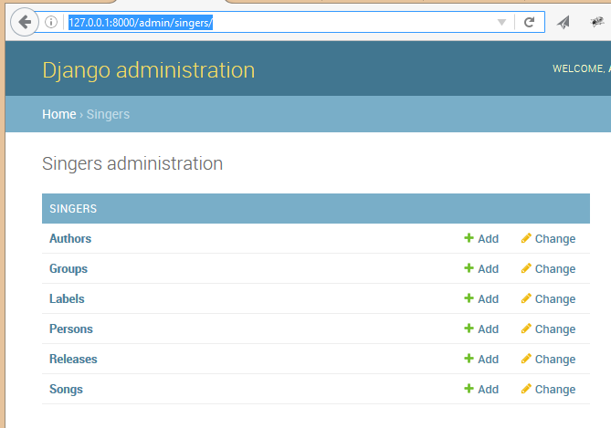

.. index::
   pair: Actions ; 2016-10-17
   pair: Django ; makemigrations

.. _action_17_october_2016:

============================================================================
2016-10-17 create singers SQL tables
============================================================================

.. contents::
   :depth: 3

The 

makemigrations singers
=======================

::

    (ajax_django_35) projet_ajax>python manage.py makemigrations singers
    
::
    
    Migrations for 'singers':
      singers\migrations\0001_initial.py:
        - Create model Author
        - Create model Book
        - Create model Group
        - Create model Label
        - Create model Person
        - Create model Release
        - Create model Song
        - Add field songs to release
        - Add field owner to label
        - Add field members to group
        - Add field about_group to book
        - Add field author to book
        - Add field mentions_persons to book

sqlmigrate singers 0001
========================

::

    (ajax_django_35) C:\projects_id3\django_ajax_select\projet_ajax>python manage.py sqlmigrate singers 0001
    
::
        
    BEGIN;
    --
    -- Create model Author
    --
    CREATE TABLE "singers_author" ("id" integer NOT NULL PRIMARY KEY AUTOINCREMENT, "name" varchar(100) NOT NULL);
    --
    -- Create model Book
    --
    CREATE TABLE "singers_book" ("id" integer NOT NULL PRIMARY KEY AUTOINCREMENT, "title" varchar(100) NOT NULL);
    --
    -- Create model Group
    --
    CREATE TABLE "singers_group" ("id" integer NOT NULL PRIMARY KEY AUTOINCREMENT, "name" varchar(200) NOT NULL UNIQUE, "url" varchar(200) NOT NULL);
    --
    -- Create model Label
    --
    CREATE TABLE "singers_label" ("id" integer NOT NULL PRIMARY KEY AUTOINCREMENT, "name" varchar(200) NOT NULL UNIQUE, "url" varchar(200) NOT NULL);
    --
    -- Create model Person
    --
    CREATE TABLE "singers_person" ("id" integer NOT NULL PRIMARY KEY AUTOINCREMENT, "name" varchar(100) NOT NULL, "email" varchar(254) NOT NULL);
    --
    -- Create model Release
    --
    CREATE TABLE "singers_release" ("id" integer NOT NULL PRIMARY KEY AUTOINCREMENT, "title" varchar(100) NOT NULL, "catalog" varchar(100) NOT NULL,
    "group_id" integer NULL REFERENCES "singers_group" ("id"), "label_id" integer NOT NULL REFERENCES "singers_label" ("id"));
    --
    -- Create model Song
    --
    CREATE TABLE "singers_song" ("id" integer NOT NULL PRIMARY KEY AUTOINCREMENT, "title" varchar(200) NOT NULL, "group_id" integer NOT NULL REFERENCES "singers_group" ("id"));
    --
    -- Add field songs to release
    --
    CREATE TABLE "singers_release_songs" ("id" integer NOT NULL PRIMARY KEY AUTOINCREMENT, "release_id" integer NOT NULL REFERENCES "singers_release" ("id"), "song_id" integer NOT NULL REFERENCES "singers_song" ("id"));
    --
    -- Add field owner to label
    --
    ALTER TABLE "singers_label" RENAME TO "singers_label__old";
    CREATE TABLE "singers_label" ("id" integer NOT NULL PRIMARY KEY AUTOINCREMENT, "name" varchar(200) NOT NULL UNIQUE, "url" varchar(200) NOT NULL,
    "owner_id" integer NULL REFERENCES "singers_person" ("id"));
    INSERT INTO "singers_label" ("url", "id", "owner_id", "name") SELECT "url", "id", NULL, "name" FROM "singers_label__old";
    DROP TABLE "singers_label__old";
    CREATE INDEX "singers_release_0e939a4f" ON "singers_release" ("group_id");
    CREATE INDEX "singers_release_abec2aca" ON "singers_release" ("label_id");
    CREATE INDEX "singers_song_0e939a4f" ON "singers_song" ("group_id");
    CREATE UNIQUE INDEX "singers_release_songs_release_id_be8581cc_uniq" ON "singers_release_songs" ("release_id", "song_id");
    CREATE INDEX "singers_release_songs_b07ccb57" ON "singers_release_songs" ("release_id");
    CREATE INDEX "singers_release_songs_e5c27d73" ON "singers_release_songs" ("song_id");
    CREATE INDEX "singers_label_5e7b1936" ON "singers_label" ("owner_id");
    --
    -- Add field members to group
    --
    CREATE TABLE "singers_group_members" ("id" integer NOT NULL PRIMARY KEY AUTOINCREMENT, "group_id" integer NOT NULL REFERENCES "singers_group" ("id"), "person_id" integer NOT NULL REFERENCES "singers_person" ("id"));
    --
    -- Add field about_group to book
    --
    ALTER TABLE "singers_book" RENAME TO "singers_book__old";
    CREATE TABLE "singers_book" ("id" integer NOT NULL PRIMARY KEY AUTOINCREMENT, "title" varchar(100) NOT NULL, "about_group_id" integer NOT NULL REFERENCES "singers_group" ("id"));
    INSERT INTO "singers_book" ("title", "id", "about_group_id") SELECT "title", "id", NULL FROM "singers_book__old";
    DROP TABLE "singers_book__old";
    CREATE UNIQUE INDEX "singers_group_members_group_id_6767fcf1_uniq" ON "singers_group_members" ("group_id", "person_id");
    CREATE INDEX "singers_group_members_0e939a4f" ON "singers_group_members" ("group_id");
    CREATE INDEX "singers_group_members_a8452ca7" ON "singers_group_members" ("person_id");
    CREATE INDEX "singers_book_13ef9fae" ON "singers_book" ("about_group_id");
    --
    -- Add field author to book
    --
    ALTER TABLE "singers_book" RENAME TO "singers_book__old";
    CREATE TABLE "singers_book" ("id" integer NOT NULL PRIMARY KEY AUTOINCREMENT, "title" varchar(100) NOT NULL, "about_group_id" integer NOT NULL REFERENCES "singers_group" ("id"), "author_id" integer NOT NULL REFERENCES "singers_author" ("id"));
    INSERT INTO "singers_book" ("author_id", "title", "id", "about_group_id") SELECT NULL, "title", "id", "about_group_id" FROM "singers_book__old";
    DROP TABLE "singers_book__old";
    CREATE INDEX "singers_book_13ef9fae" ON "singers_book" ("about_group_id");
    CREATE INDEX "singers_book_4f331e2f" ON "singers_book" ("author_id");
    --
    -- Add field mentions_persons to book
    --
    CREATE TABLE "singers_book_mentions_persons" ("id" integer NOT NULL PRIMARY KEY AUTOINCREMENT, "book_id" integer NOT NULL REFERENCES "singers_book" ("id"), "person_id" integer NOT NULL REFERENCES "singers_person" ("id"));
    CREATE UNIQUE INDEX "singers_book_mentions_persons_book_id_873aadf4_uniq" ON "singers_book_mentions_persons" ("book_id", "person_id");
    CREATE INDEX "singers_book_mentions_persons_0a4572cc" ON "singers_book_mentions_persons" ("book_id");
    CREATE INDEX "singers_book_mentions_persons_a8452ca7" ON "singers_book_mentions_persons" ("person_id");
    COMMIT;

migrate singers
================

.. seealso::

   - https://docs.djangoproject.com/en/dev/intro/tutorial02/
   - https://docs.djangoproject.com/fr/1.10/intro/tutorial02/

::

    (ajax_django_35) C:\projects_id3\django_ajax_select\projet_ajax>python manage.py migrate singers
    
::
    
    Operations to perform:
      Apply all migrations: singers
    Running migrations:
      Applying singers.0001_initial... OK
 
      
  
show-migrations
===============

::
  
    (ajax_django_35) C:\projects_id3\django_ajax_select\projet_ajax>python manage.py showmigrations
    
::
        
    admin
     [X] 0001_initial
     [X] 0002_logentry_remove_auto_add
    auth
     [X] 0001_initial
     [X] 0002_alter_permission_name_max_length
     [X] 0003_alter_user_email_max_length
     [X] 0004_alter_user_username_opts
     [X] 0005_alter_user_last_login_null
     [X] 0006_require_contenttypes_0002
     [X] 0007_alter_validators_add_error_messages
     [X] 0008_alter_user_username_max_length
    contenttypes
     [X] 0001_initial
     [X] 0002_remove_content_type_name
    sessions
     [X] 0001_initial
    singers
     [X] 0001_initial

createsuperuser
================

::

    (ajax_django_35) C:\projects_id3\django_ajax_select\projet_ajax>python manage.py createsuperuser
    
::
    
    Username (leave blank to use 'pvergain'): admin
    Email address: pvergain@gmail.com
    Password:
    Password (again):
    This password is too short. It must contain at least 8 characters.
    This password is too common.
    Password:
    Password (again):
    The password is too similar to the email address.
    Password:
    Password (again):
    Superuser created successfully.

    
Connect to the admin interface
===============================      

.. seealso:: http://127.0.0.1:8000/admin/

   
   

  
  
