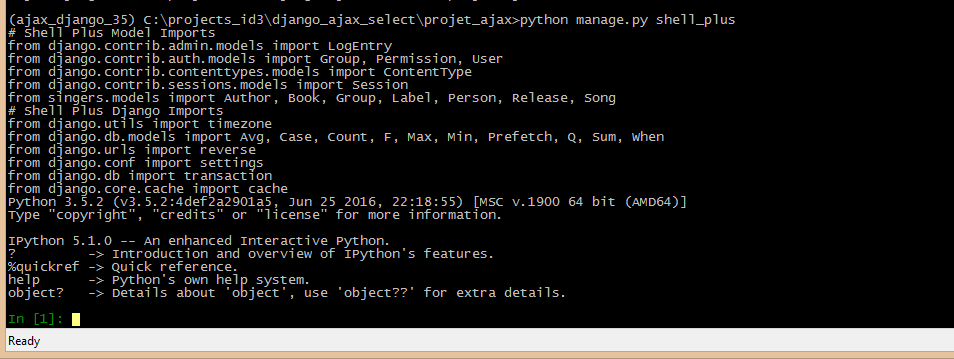
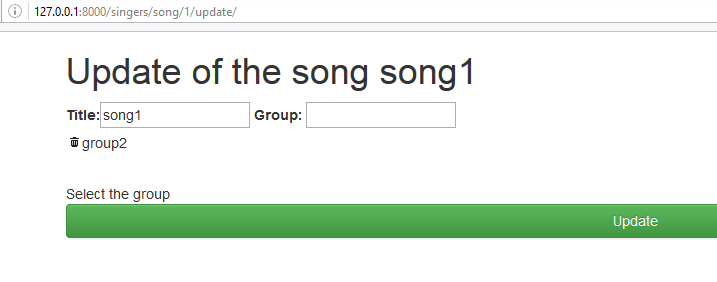
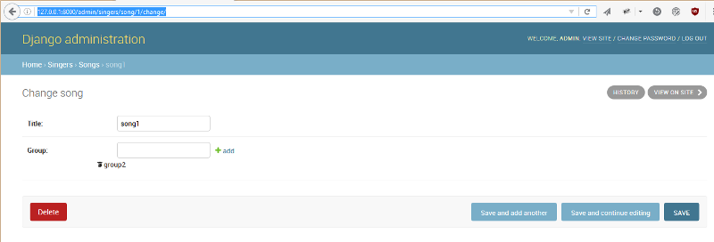

.. index::
   pair: Django ; base.html
   pair: Template ; inheritance
   pair: Django ; django-extensions
   

.. _base_template:

============================================================================
2016-10-18 create some Django Templates : base.html  
============================================================================

.. seealso::

   - https://docs.djangoproject.com/en/dev/ref/templates/language/#
   
   
.. contents::
   :depth: 3

The Django Template templates/base.html
========================================

.. literalinclude:: ../../../../../projet_ajax/templates/base.html
   :linenos:
   :language: django
  
  
   
::

    |   ajax_selects_singers_db
    |   manage.py
    |   
    +---projet_ajax
    |   |   settings.py
    |   |   urls.py
    |   |   wsgi.py
    |   |   __init__.py
    |           
    +---singers
    |   |   admin.py
    |   |   apps.py
    |   |   forms.py
    |   |   lookups.py
    |   |   models.py
    |   |   tests.py
    |   |   urls.py
    |   |   views.py
    |   |   __init__.py
    |   |   
    |   +---migrations
    |   |   |   0001_initial.py
    |   |   |   0002_auto_20161017_1612.py
    |   |   |   0003_auto_20161017_1632.py
    |   |   |   __init__.py
    |   |           
    |           
    \---templates
            base.html
            search_form.html
            
            
The Django Template singers/templates/song/update.html
========================================================

.. seealso::

   - https://docs.djangoproject.com/en/dev/ref/templates/builtins/#std:templatetag-extends

The template :file:`templates/singers/song/update.html` extends the :file:`templates\base.html` **base template**.

.. literalinclude:: ../../../../../projet_ajax/singers/templates/singers/song/update.html
   :linenos:
   :language: django
   
   
Add the django-extensions and ipython modules
==============================================

::

    pip install django-extensions ipython
    

In the projet_ajax/settings.py file::

    INSTALLED_APPS = [
        'django.contrib.admin',
        'django.contrib.auth',
        'django.contrib.contenttypes',
        'django.contrib.sessions',
        'django.contrib.messages',
        'django.contrib.staticfiles',

        # https://django-extensions.readthedocs.org/en/latest
        'django_extensions',

       
New django commands
--------------------

::

    [django_extensions]
        admin_generator
        clean_pyc
        clear_cache
        compile_pyc
        create_app
        create_command
        create_jobs
        create_template_tags
        describe_form
        drop_test_database
        dumpscript
        export_emails
        find_template
        generate_secret_key
        graph_models
        mail_debug
        notes
        passwd
        pipchecker
        print_settings
        print_user_for_session
        reset_db
        runjob
        runjobs
        runprofileserver
        runscript
        runserver_plus
        set_default_site
        set_fake_emails
        set_fake_passwords
        shell_plus
        show_template_tags
        show_templatetags
        show_urls
        sqlcreate
        sqldiff
        sqldsn
        sync_s3
        syncdata
        unreferenced_files
        update_permissions
        validate_templates

The *shell_plus* command is very usefull.

   

Get the first song
===========================

::

    In [1]:  first_song = Song.objects.all().first()

    In [2]: first_song.id
    Out[2]: 1
       
   
Try the URL : http://127.0.0.1:8000/singers/song/1/update
==========================================================

.. seealso::

   - http://127.0.0.1:8000/singers/song/1/update
   
   
Not very nice and not very easy to use. 

   
      
   
Compared to the django admin interface
=======================================

.. seealso:: 

   - http://127.0.0.1:8000/admin/singers/song/1/change/

More nice but not very easy to use. 

   
   
Conclusion
============

Try the django-autocomplete-light module.

   
       
      

            
