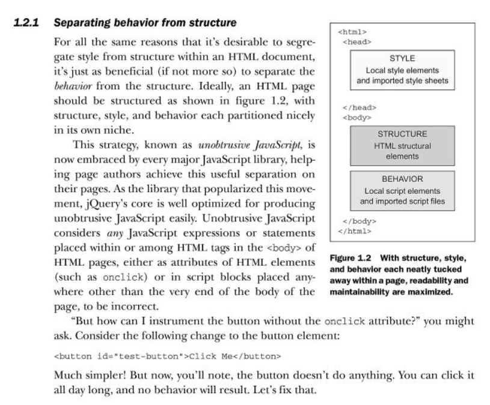
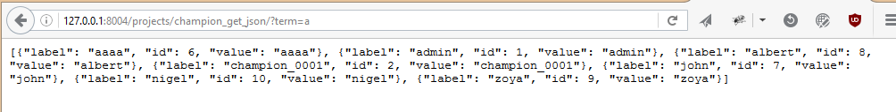
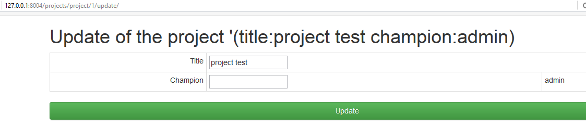

.. index::
   pair: Django ; Template
   pair: Javascript ; Unobstrusive

.. _javascript_unobstrusive:

============================================================================
2016-10-19 improve the Django templates + unobstrusive Javascript (step1)
============================================================================

.. contents::
   :depth: 3

The Javascript code must be in the the body element
=====================================================

.. seealso::

   - https://www.amazon.fr/gp/product/1617292079/ref=oh_aui_detailpage_o00_s00?ie=UTF8&psc=1
   

   
   
Modify names
============

- champion_auto_complete -> champion_get_json

Test champion_get_json : http://127.0.0.1:8004/projects/champion_get_json/?term=a
===================================================================================

.. seealso:: http://127.0.0.1:8004/projects/champion_get_json/?term=a

   

Rendering fields manually   
==========================
   
.. seealso:: 

   - https://docs.djangoproject.com/en/dev/topics/forms/#rendering-fields-manually   
   - https://docs.djangoproject.com/en/dev/topics/forms/#looping-over-hidden-and-visible-fields

   
   
Adding django-debug-toolbar
===========================

.. seealso::

   - https://django-debug-toolbar.readthedocs.io/en/stable/index.html
   - https://django-debug-toolbar.readthedocs.io/en/stable/installation.html

::

    pip install django-debug-toolbar

::

        # https://django-extensions.readthedocs.org/en/latest
        'django_extensions',

        # http://django-ajax-selects.readthedocs.io/en/latest/index.html
        'ajax_select',
        # http://django-crispy-forms.readthedocs.io/en/latest/install.html#installing-django-crispy-forms
        'crispy_forms',
        # https://github.com/jazzband/django-debug-toolbar
        'debug_toolbar',

        # # https://docs.djangoproject.com/en/dev/ref/applications/#django.apps.AppConfig
        'singers.apps.SingersConfig',
        # http://guiqinqian.blogspot.fr/2012/01/using-jquery-auto-complete-in-django.html
        'projects.apps.ProjectsConfig'
    ]

::

    if settings.DEBUG:
        import debug_toolbar
        urlpatterns += [
            url(r'^__debug__/', include(debug_toolbar.urls)),
        ]

::

    MIDDLEWARE = [
        'django.middleware.security.SecurityMiddleware',
        'django.contrib.sessions.middleware.SessionMiddleware',
        'django.middleware.common.CommonMiddleware',
        'django.middleware.csrf.CsrfViewMiddleware',
        'django.contrib.auth.middleware.AuthenticationMiddleware',
        'django.contrib.messages.middleware.MessageMiddleware',
        'django.middleware.clickjacking.XFrameOptionsMiddleware',

        'debug_toolbar.middleware.DebugToolbarMiddleware'
    ]

.. warning:: do not forget to set the new INTERNAL_IPS variable

   INTERNAL_IPS = '127.0.0.1'
   
   
   
First step for a better look
=============================

.. seealso:: http://127.0.0.1:8004/projects/project/1/update/

   
   
   

   
   
   
