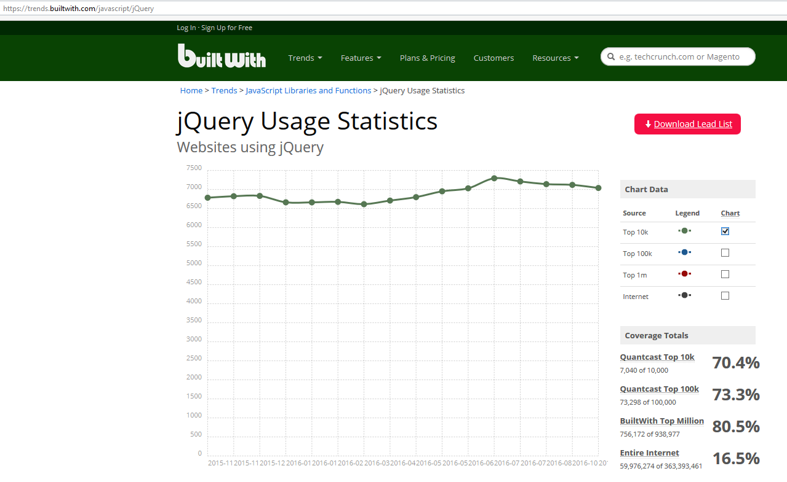
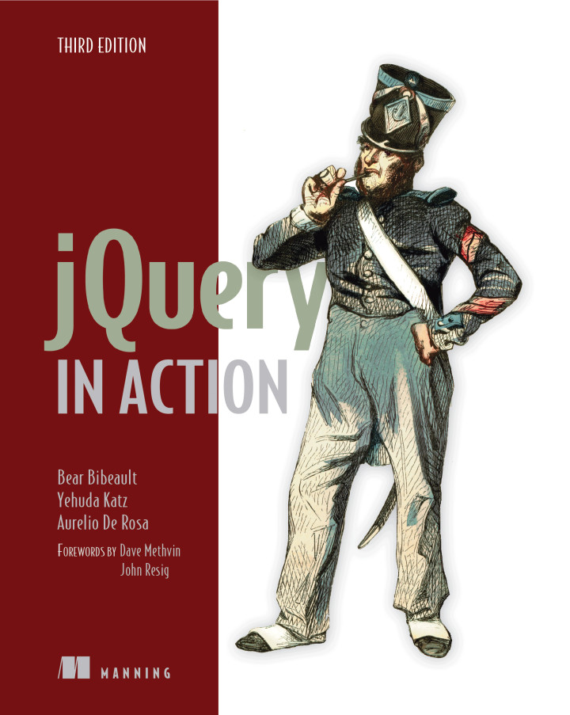
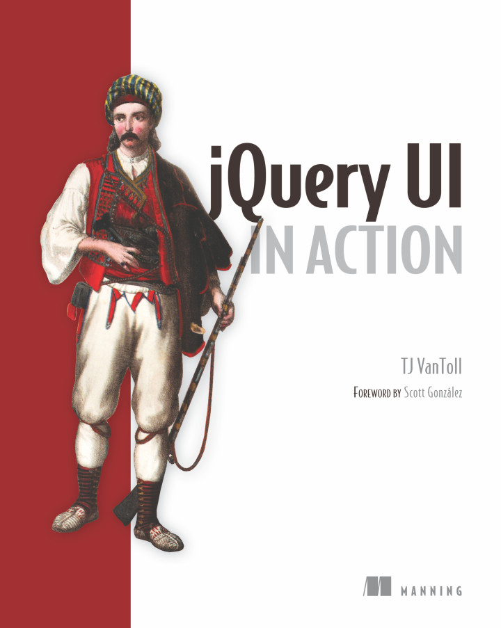

.. index::
   pair: jQuery ; TJ VanToll
   pair: jQuery ; Aurelio De Rosa
   ! jQuery
   
   

.. _jquery_in_action:

========================================================================================================
2016-10-21 Receive 2 new excellent books about jQuery: ``jQuery In Action`` and ``jquery UI in Action``
========================================================================================================

.. seealso::

   - https://twitter.com/tjvantoll
   - https://twitter.com/AurelioDeRosa
   - http://developer.telerik.com/featured/is-jquery-still-relevant/
   - https://trends.builtwith.com/javascript/jQuery
   

.. contents::
   :depth: 3

   
   https://trends.builtwith.com/javascript/jQuery

If you were starting a new web app tomorrow, would you use jQuery ?
====================================================================

.. seealso::

   - https://twitter.com/tjvantoll
   - https://twitter.com/AurelioDeRosa
   - http://developer.telerik.com/featured/is-jquery-still-relevant/

Aurelio De Rosa
---------------   
   
::

    I don't use it by default anymore, but it also depends on the project and the browsers 
    I have to support. These days I don't have to support IE8 anymore, but I'm 
    still maintaining some code bases developed a couple of years ago that needed 
    to support IE8. So, I still see jQuery around from time to time.
    
    I think we can all agree that jQuery is not the tool for building SPAs, but 
    to be honest, it was never conceived for that.    
   
TJ VanToll 
-----------

::

    Exactly. I still find jQuery to provide the exact mix of functionality I 
    need for little sites like that. 
    I would probably not, however, use jQuery if I were starting on a large complex 
    app nowadays. I think modern frameworks like Angular 2 just provide better 
    paradigms for building apps at that scale.   
   

jQuery in Action (third edition)
=================================

.. seealso::

   - https://github.com/AurelioDeRosa/jquery-in-action
   - https://twitter.com/AurelioDeRosa
   - https://www.manning.com/books/jquery-in-action-third-edition
   

   
   

   
   Aurelio De Rosa (https://twitter.com/AurelioDeRosa)

clone
-----

::

    git clone https://github.com/AurelioDeRosa/jquery-in-action
    
    

jQuery UI in Action
====================

.. seealso::

   - https://github.com/tjvantoll/jquery-ui-in-action-demos
   - https://twitter.com/tjvantoll
   - https://twitter.com/jenlooper   
   - https://www.manning.com/books/jquery-ui-in-action
   
   

   

.. figure:: TJVanToll.jpeg
   :align: center   
   
   TJ Vantoll (https://twitter.com/tjvantoll)

jquery plugins
===============

.. toctree::
   :maxdepth: 3
   
   plugins/plugins
   
   
   

   
