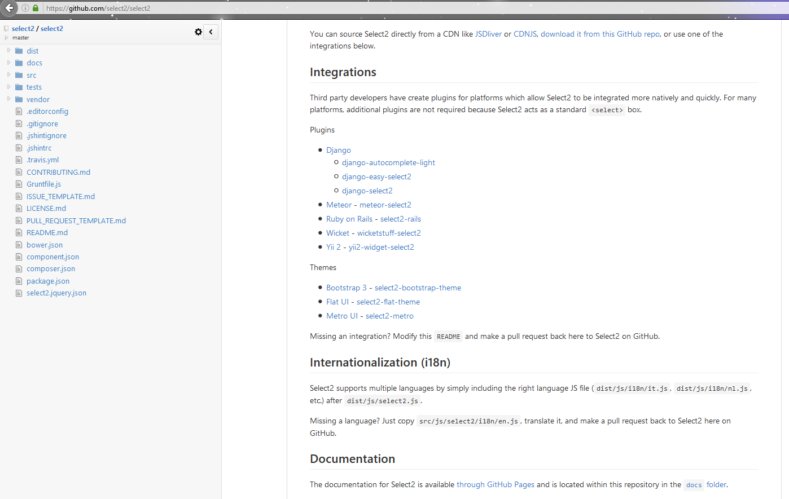

.. index::
   pair: jQuery ; select2

.. _select2_plugin:
   
======================
jquery select2 plugin
======================

.. seealso::

   - https://github.com/select2/select2
   - https://select2.github.io/announcements-4.0.html

.. contents::
   :depth: 3
   

   
Use cases
==========

- Enhancing native selects with search.
- Enhancing native selects with a better multi-select interface.
- Loading data from JavaScript: easily load items via AJAX and have them 
  searchable.
- Nesting optgroups: native selects only support one level of nesting. 
  Select2 does not have this restriction.
- Tagging: ability to add new items on the fly.
- Working with large, remote datasets: ability to partially load a dataset 
  based on the search term.
- Paging of large datasets: easy support for loading more pages when the 
  results are scrolled to the end.
- Templating: support for custom rendering of results and selections.

