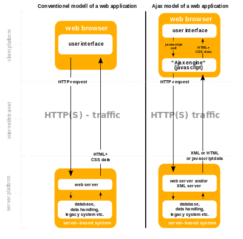

.. index::
   pair: Project ; Django AJAX autocomplete 
   pair: Read the docs; Documentation

.. _django_test_ajax_autocomplete:

=======================================================================
Dango project for testing AJAX autocomplete plugins 
=======================================================================

.. seealso::

   - https://django-test-autocomplete.readthedocs.io/en/latest/
   - https://github.com/pvergain/django-test-autocomplete.git
   - https://en.wikipedia.org/wiki/Ajax_(programming)
   - https://en.wikipedia.org/wiki/JSON

.. sidebar:: Dango test AJAX autocomplete

    :Projet: Dango test AJAX autocomplete
    :Release: |release|
    :Date: |today|
    :Authors: **pvergain**
    
    - :ref:`genindex`
    - :ref:`search` 
    - :ref:`glossary`
 
    Thanks https://readthedocs.org/
    
    - https://readthedocs.org/projects/django-test-autocomplete/

   
   :term:`AJAX` source: https://en.wikipedia.org/wiki/Ajax_(programming)

  

   
   :term:`JSON` logo (https://en.wikipedia.org/wiki/JSON)
   

.. figure:: _static/httpie_logo.jpg
   :align: center  
   
   httpie logo (https://httpie.org/)
   

.. toctree::
   :maxdepth: 5
   
   introduction/introduction
   tests/tests
   actions/actions
   dev/dev
   versions/versions
   glossary/glossary

