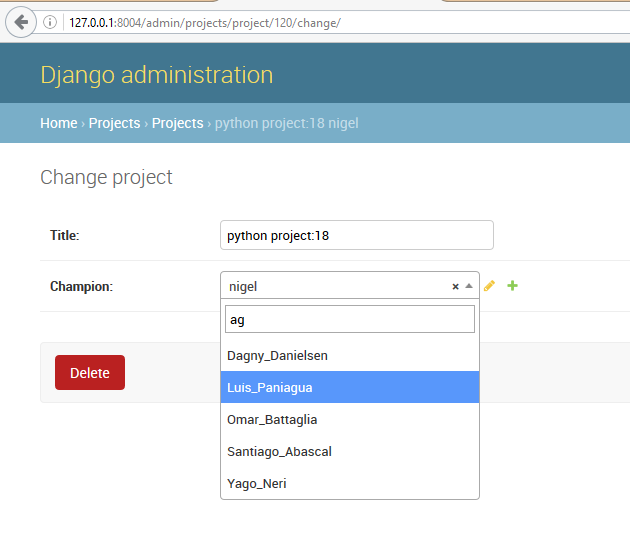

.. index::
   pair: Django ; django-autocomplete-light 

.. _django_autocomplete_light:

================================
django-autocomplete-light test
================================

.. seealso::

   - https://github.com/yourlabs/django-autocomplete-light.git
   - https://github.com/select2/select2.git
   - https://github.com/django/django/blob/master/django/contrib/admin/templates/admin/base.html

.. contents::
   :depth: 3
   
   

   
      

install
========

::

    pip install django-autocomplete-light   

update the settings.py module
-----------------------------

Add the 2 following applications:

- dal
- dal-select2

::

    # Applications definition
    INSTALLED_APPS = [
        'dal',
        'dal_select2',

tree
=====

::

    C:\PROJECTS_ID3\DJANGO-TEST-AUTOCOMPLETE\ANNEXES\DJANGO-AUTOCOMPLETE-LIGHT
    |   .gitignore
    |   .gitmodules
    |   .travis.yml
    |   AUTHORS
    |   CHANGELOG
    |   CHANGES.txt
    |   LICENSE
    |   MANIFEST.in
    |   pytest.ini
    |   README
    |   README.rst
    |   setup.py
    |   tox.ini
    |   
    +---.openshift
    |   |   README.md
    |   |   
    |   +---action_hooks
    |   |       deploy
    |   |       README.md
    |   |       
    |   \---cron
    |       |   README.cron
    |       |   
    |       \---hourly
    |               reset_database
    |               
    +---docs
    |   |   api.rst
    |   |   conf.py
    |   |   creation.rst
    |   |   genericm2m.rst
    |   |   gfk.rst
    |   |   gm2m.rst
    |   |   index.rst
    |   |   install.rst
    |   |   Makefile
    |   |   requirements.txt
    |   |   tagging.rst
    |   |   taggit.rst
    |   |   tutorial.rst
    |   |   
    |   +---img
    |   |       all.png
    |   |       autocomplete.png
    |   |       created_option.png
    |   |       create_option.png
    |   |       mine.png
    |   |       view.png
    |   |       
    |   \---_ext
    |           djangodocs.py
    |           
    +---src
    |   |   __init__.py
    |   |   
    |   +---dal
    |   |   |   autocomplete.py
    |   |   |   forms.py
    |   |   |   forward.py
    |   |   |   views.py
    |   |   |   widgets.py
    |   |   |   __init__.py
    |   |   |   
    |   |   +---static
    |   |   |   +---admin
    |   |   |   |   \---js
    |   |   |   |           jquery.init.js
    |   |   |   |           
    |   |   |   \---autocomplete_light
    |   |   |           autocomplete.init.js
    |   |   |           forward.js
    |   |   |           jquery.init.js
    |   |   |           
    |   |   \---test
    |   |           case.py
    |   |           stories.py
    |   |           utils.py
    |   |           __init__.py
    |   |           
    |   +---dal_contenttypes
    |   |       fields.py
    |   |       __init__.py
    |   |       
    |   +---dal_genericm2m
    |   |       fields.py
    |   |       __init__.py
    |   |       
    |   +---dal_genericm2m_queryset_sequence
    |   |       fields.py
    |   |       __init__.py
    |   |       
    |   +---dal_gm2m
    |   |       fields.py
    |   |       __init__.py
    |   |       
    |   +---dal_gm2m_queryset_sequence
    |   |       fields.py
    |   |       __init__.py
    |   |       
    |   +---dal_queryset_sequence
    |   |   |   fields.py
    |   |   |   views.py
    |   |   |   widgets.py
    |   |   |   __init__.py
    |   |   |   
    |   |   \---tests
    |   |           test_views.py
    |   |           
    |   +---dal_select2
    |   |   |   apps.py
    |   |   |   checks.py
    |   |   |   fields.py
    |   |   |   models.py
    |   |   |   test.py
    |   |   |   views.py
    |   |   |   widgets.py
    |   |   |   __init__.py
    |   |   |   
    |   |   \---static
    |   |       \---autocomplete_light
    |   |           |   select2.css
    |   |           |   select2.js
    |   |           |   
    |   |           \---vendor
    |   |               \---select2
    |   +---dal_select2_queryset_sequence
    |   |       views.py
    |   |       widgets.py
    |   |       __init__.py
    |   |       
    |   +---dal_select2_tagging
    |   |       widgets.py
    |   |       __init__.py
    |   |       
    |   \---dal_select2_taggit
    |           widgets.py
    |           __init__.py
    |           
    \---test_project
        |   .coveragerc
        |   db.sqlite3
        |   manage.py
        |   requirements.txt
        |   reset.json
        |   urls.py
        |   views.py
        |   wsgi.py
        |   
        +---linked_data
        |   |   admin.py
        |   |   apps.py
        |   |   forms.py
        |   |   models.py
        |   |   test_forms.py
        |   |   test_functional.py
        |   |   urls.py
        |   |   __init__.py
        |   |   
        |   +---migrations
        |   |       0001_initial.py
        |   |       __init__.py
        |   |       
        |   \---static
        |           linked_data.js
        |           
        +---rename_forward
        |   |   admin.py
        |   |   apps.py
        |   |   forms.py
        |   |   models.py
        |   |   test_forms.py
        |   |   test_functional.py
        |   |   urls.py
        |   |   __init__.py
        |   |   
        |   +---migrations
        |   |       0001_initial.py
        |   |       __init__.py
        |   |       
        |   \---static
        |           linked_data.js
        |           
        +---secure_data
        |   |   admin.py
        |   |   apps.py
        |   |   forms.py
        |   |   models.py
        |   |   test_functional.py
        |   |   urls.py
        |   |   views.py
        |   |   __init__.py
        |   |   
        |   \---migrations
        |           0001_initial.py
        |           __init__.py
        |           
        +---select2_foreign_key
        |   |   admin.py
        |   |   apps.py
        |   |   forms.py
        |   |   models.py
        |   |   test_functional.py
        |   |   urls.py
        |   |   __init__.py
        |   |   
        |   \---migrations
        |           0001_initial.py
        |           __init__.py
        |           
        +---select2_generic_foreign_key
        |   |   admin.py
        |   |   apps.py
        |   |   forms.py
        |   |   models.py
        |   |   test_forms.py
        |   |   test_functional.py
        |   |   urls.py
        |   |   views.py
        |   |   __init__.py
        |   |   
        |   \---migrations
        |           0001_initial.py
        |           __init__.py
        |           
        +---select2_generic_m2m
        |   |   admin.py
        |   |   apps.py
        |   |   forms.py
        |   |   models.py
        |   |   test_forms.py
        |   |   test_functional.py
        |   |   urls.py
        |   |   views.py
        |   |   __init__.py
        |   |   
        |   \---migrations
        |           0001_initial.py
        |           __init__.py
        |           
        +---select2_gm2m
        |   |   admin.py
        |   |   apps.py
        |   |   forms.py
        |   |   models.py
        |   |   test_forms.py
        |   |   test_functional.py
        |   |   urls.py
        |   |   views.py
        |   |   __init__.py
        |   |   
        |   \---migrations
        |           0001_initial.py
        |           __init__.py
        |           
        +---select2_list
        |   |   admin.py
        |   |   forms.py
        |   |   models.py
        |   |   test_fields.py
        |   |   test_functional.py
        |   |   test_views.py
        |   |   urls.py
        |   |   views.py
        |   |   __init__.py
        |   |   
        |   \---migrations
        |           0001_initial.py
        |           __init__.py
        |           
        +---select2_many_to_many
        |   |   admin.py
        |   |   apps.py
        |   |   forms.py
        |   |   models.py
        |   |   test_functional.py
        |   |   urls.py
        |   |   __init__.py
        |   |   
        |   \---migrations
        |           0001_initial.py
        |           __init__.py
        |           
        +---select2_one_to_one
        |   |   admin.py
        |   |   apps.py
        |   |   forms.py
        |   |   models.py
        |   |   test_functional.py
        |   |   urls.py
        |   |   __init__.py
        |   |   
        |   \---migrations
        |           0001_initial.py
        |           __init__.py
        |           
        +---select2_outside_admin
        |   |   urls.py
        |   |   views.py
        |   |   __init__.py
        |   |   
        |   \---templates
        |           select2_outside_admin.html
        |           
        +---select2_tagging
        |   |   admin.py
        |   |   forms.py
        |   |   models.py
        |   |   test_forms.py
        |   |   test_functional.py
        |   |   urls.py
        |   |   __init__.py
        |   |   
        |   \---migrations
        |           0001_initial.py
        |           0002_testmodel_test.py
        |           __init__.py
        |           
        +---select2_taggit
        |   |   admin.py
        |   |   forms.py
        |   |   models.py
        |   |   test_forms.py
        |   |   test_functional.py
        |   |   urls.py
        |   |   __init__.py
        |   |   
        |   \---migrations
        |           0001_initial.py
        |           __init__.py
        |           
        +---settings
        |       base.py
        |       __init__.py
        |       
        +---templates
        |   |   base.html
        |   |   
        |   \---admin
        |           login.html
        |           
        \---tests
                admin.py
                models.py
                test_widgets.py
                __init__.py

projects/views_django_autocomplete_light.py
===========================================

::

    from django.contrib.auth.models import User

    from django.db.models import Q
    from dal import autocomplete

    class ApiUserDjangoAutocompleteLight(autocomplete.Select2QuerySetView):
        """https://django-autocomplete-light.readthedocs.io/en/master/tutorial.html"""
        def get_queryset(self):
            # Don't forget to filter out results depending on the visitor !
            users = User.objects.all()

            if self.q:
                users = User.objects.filter(Q(username__icontains=self.q)
                                            | Q(email__icontains=self.q)).order_by('username')

            return users

projects/api/get_users/?q  (projects/urls.py)
==============================================

::

    url(r'^api/get_users/$',
        ApiUserDjangoAutocompleteLight.as_view(),
        name='api_get_users'),

test
----

::

    {"pagination": {"more": true}, "results": [{"text": "Aaron_De Angelis", "id": 119}, 
    {"text": "Abdul_Parker", "id": 177}, {"text": "Adolf_Wahlberg", "id": 338}, 
    {"text": "Adrian_Jenkins", "id": 184}, {"text": "Aim\u00e9_Roussel", "id": 42}, 
    {"text": "Alejandro_Hoyos", "id": 240}, {"text": "Alexander_Dahlberg", "id": 335}, 
    {"text": "Alexandria_Weiss", "id": 29}, {"text": "Alicia_Pareja", "id": 149}, 
    {"text": "Alighieri_Coppola", "id": 216}]}

projects/forms_django_autocomplete_light.py
===========================================

.. code-block:: python 

    from django import forms

    from .models import Project

    from dal import autocomplete

    class ProjectFormDjangoAutocomplete(forms.ModelForm):
        """https://django-autocomplete-light.readthedocs.io/en/master/tutorial.html"""
        class Meta:
            model = Project
            fields = ('__all__')
            widgets = {
                'champion': autocomplete.ModelSelect2(url='projects:api_get_users')
            }

projects/admin.py
==================

    #!/usr/bin/python
    # -*- coding: UTF-8 -*-
    """Project Administration.

    """

    from django.contrib import admin

    from .models import Project

    from .forms_django_autocomplete_light import ProjectFormDjangoAutocomplete

    @admin.register(Project)
    class ProjectAdmin(admin.ModelAdmin):
        """Project administration

        Documentation
        =============

        - https://docs.djangoproject.com/en/dev/ref/contrib/admin/#modeladmin-objects

        """
        form = ProjectFormDjangoAutocomplete
        list_display = ('title', 'champion')
        search_fields = ('title', 'champion')
        list_filter = ('title', 'champion')

Using autocompletes in the admin : nice !
------------------------------------------

   

Using autocompletes outside the admin 
======================================  
   
 
 
projects/views_django_autocomplete_light.py
---------------------------------------------

::

       
    from django.contrib.auth.models import User

    from django.db.models import Q
    from django.views.generic.edit import UpdateView

    from dal import autocomplete

    from .models import Project

    from .forms_django_autocomplete_light import ProjectFormDjangoAutocomplete

    # Get an instance of a logger
    logger = logging.getLogger(__name__)

    class ApiUserDjangoAutocompleteLight(autocomplete.Select2QuerySetView):
        """https://django-autocomplete-light.readthedocs.io/en/master/tutorial.html"""
        def get_queryset(self):
            # Don't forget to filter out results depending on the visitor !
            users = User.objects.all()
            if self.q:
                users = User.objects.filter(Q(username__icontains=self.q)
                                            | Q(email__icontains=self.q)).order_by('username')

            return users

    class ProjectDjangoAutoCompleteUpdateView(UpdateView):
        """Update the view with the jQuery UI Autocomplete plugin.

        Documentation:

        - http://ccbv.co.uk/projects/Django/1.10/django.views.generic.edit/UpdateView/

        """
        model = Project
        form_class = ProjectFormDjangoAutocomplete
        context_object_name = 'project'
        template_name = 'projects/project/update_django_autocomplete_light.html'

        def get_object(self, queryset=None):
            """Pour mémoriser self.demande_article"""
            self.object = super(ProjectDjangoAutoCompleteUpdateView, self).get_object(queryset)
            return self.object

        def post(self, request, *args, **kwargs):
            logger.warning("Hello from ProjectDjangoAutoCompleteUpdateView !")
            return super(ProjectDjangoAutoCompleteUpdateView, self).post(request, *args, **kwargs)

Django template
-----------------

.. seealso::

   - https://github.com/django/django/blob/master/django/contrib/admin/templates/admin/base.html
   

   
   

   
   

.. code-block:: django

    {# inherit from the django admin base.html file #}
    {################################################}
    
    
    

    
            <title>Django autocomplete  example</title>
    

    
    <!-- STRUCTURE -> HTML5 elements -->
        <h1>Test Django autocomplete</h1>
        <h1>Update of the project '(title:{{ project.title }} champion:{{ project.champion.username }}) </h1>
        

        

        {# https://docs.djangoproject.com/en/dev/topics/forms/ #}
        <form id="id_form_project" action="" method="post">
            
            

                {{ form.id }}
                {{ form.non_field_errors }}
                {# Include the hidden fields #}
                
                    {# here we will have the champion filed (which is hidden) #}
                    {{ hidden }}
                
                <table id="id_table" class="table table-hover table-bordered table-condensed">
                    <tbody>
                            <tr>
                                <td class="text-right">Title:</td>
                                <td>{{ form.title }}</td>
                            </tr>
                            <tr>
                                <td class="text-right">Champion:</td>
                                <td> {{ form.champion }}  </td>
                            </tr>
                    </tbody>
                </table>
            

            <input type="submit" name="btn_update"  value="Update" class="btn btn-success btn-block" />
        </form>
    <!-- end STRUCTURE-->

    
    {# https://github.com/yourlabs/django-autocomplete-light/blob/master/test_project/select2_outside_admin/templates/select2_outside_admin.html #}
    

    {{ form.media }}
    

Test URL http://127.0.0.1:8004/projects/project/1/update_django_autocomplete
==============================================================================

   
   
   
   
Passing options to select2
============================

Select2 supports a bunch of options. These options may be set in data-* attributes. 

For example::

    # Instanciate a widget with a bunch of options for select2:
    autocomplete.ModelSelect2(
        url='select2_fk',
        attrs={
            # Set some placeholder
            'data-placeholder': 'Autocomplete ...',
            # Only trigger autocompletion after 3 characters have been typed
            'data-minimum-input-length': 3,
        },
    )

   

         
   
   
   

