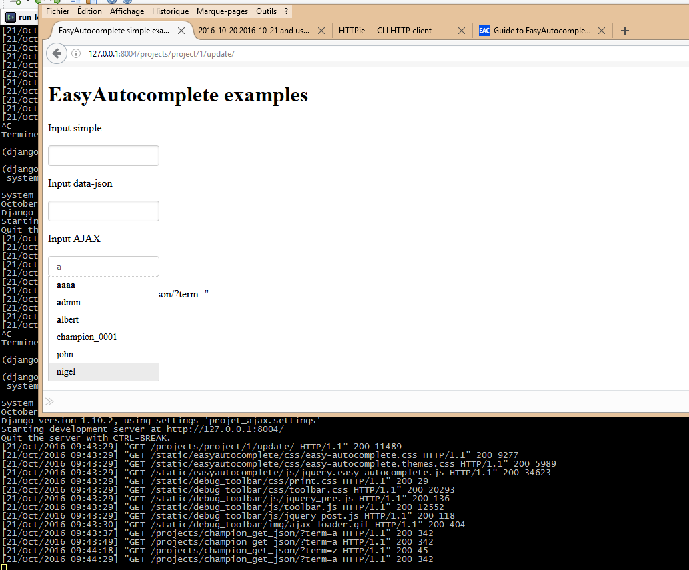

.. index::
   pair: Version ; 0.1.0 (2016-10-21)

.. _version_0_1_0:

===========================
Version 0.1.0 (2016-10-21)
===========================

.. seealso::

   - http://keepachangelog.com
   - https://github.com/pvergain/django-test-autocomplete/tree/0.1.0

   

::

    git tag 0.1.0

    (django_test_autocomplete_35_64) C:\projects_id3\django-test-autocomplete>git tag 0.1.0

    (django_test_autocomplete_35_64) C:\projects_id3\django-test-autocomplete>git push origin --tags
    Fatal: ArgumentException encountered.
    "C:/Program Files (x86)/GitExtensions/GitCredentialWinStore/git-credential-winstore.exe" get: C:/Program Files (x86)/GitExtensions/GitCredentialWinStore/git-credential-winstore.exe: No such file or directory
    Username for 'https://github.com': pvergain
    Password for 'https://pvergain@github.com':
    Fatal: ArgumentException encountered.
    "C:/Program Files (x86)/GitExtensions/GitCredentialWinStore/git-credential-winstore.exe" store: C:/Program Files (x86)/GitExtensions/GitCredentialWinStore/git-credential-winstore.exe: No such file or directory
    Total 0 (delta 0), reused 0 (delta 0)
    To https://github.com/pvergain/django-test-autocomplete.git
     * [new tag]         0.1.0 -> 0.1.0

Added
======

.. seealso:: 

   - :ref:`adding_ajax_call`

This is the First version !

The best autocomplete jquery plugin for the non-admin Django is the jquery 
EasyAutocomplete plugin

Changed
========
  

Miscellaneous 
=============

Fixed
======

Test 
=====
